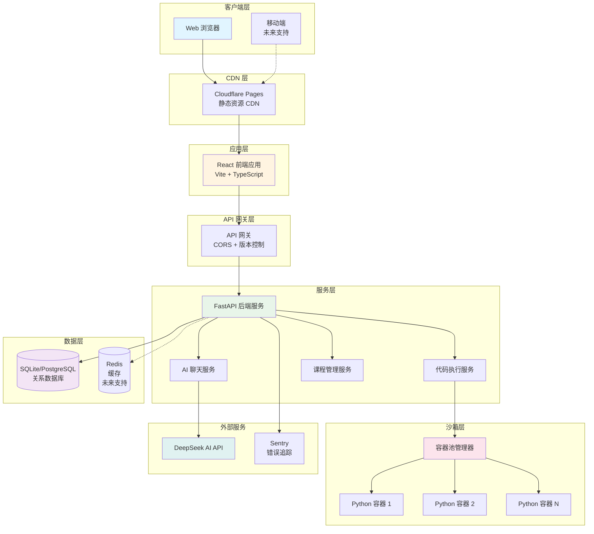
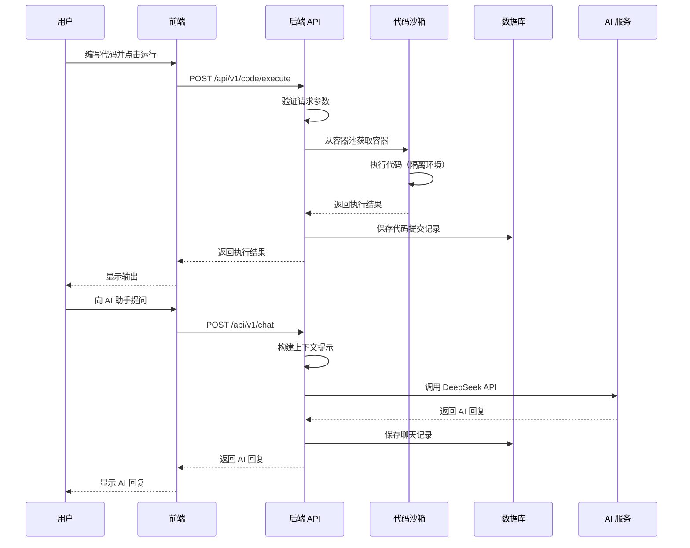
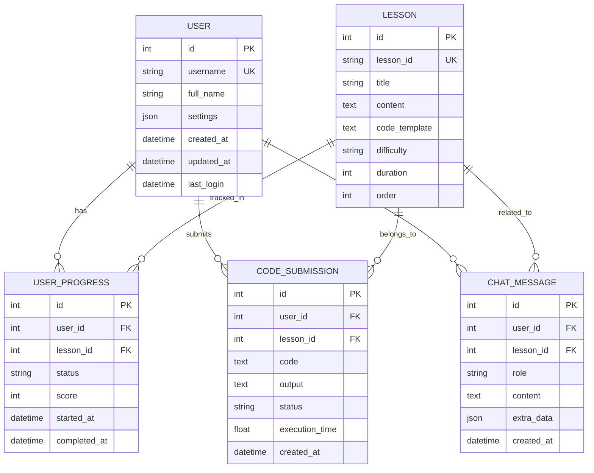
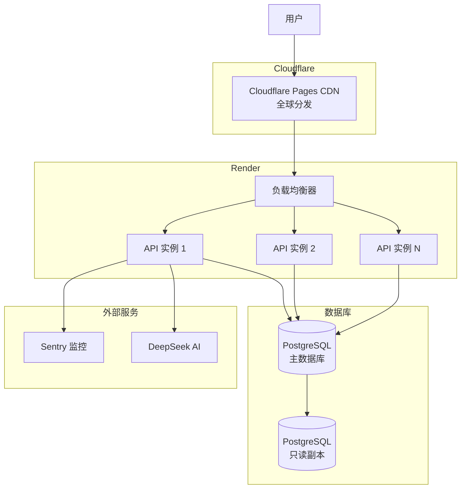
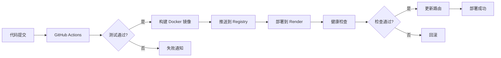

# 系统架构设计文档

**HelloAgents 学习平台架构设计**

本文档详细描述 HelloAgents 学习平台的系统架构、技术栈、设计决策和最佳实践。

---

## 📋 目录

- [系统概述](#系统概述)
- [架构设计](#架构设计)
- [技术栈](#技术栈)
- [核心模块](#核心模块)
- [数据模型](#数据模型)
- [API 设计](#api-设计)
- [安全设计](#安全设计)
- [性能优化](#性能优化)
- [监控与日志](#监控与日志)
- [部署架构](#部署架构)
- [扩展性设计](#扩展性设计)
- [技术债务](#技术债务)

---

## 系统概述

### 项目背景

HelloAgents 是一个帮助开发者学习 AI Agent 开发的互动式学习平台，提供结构化课程、在线编码环境和 AI 助手支持。

### 核心目标

- **易用性**: 零配置，打开浏览器即可学习
- **安全性**: Docker 隔离的安全代码执行环境
- **交互性**: 实时 AI 助手辅导和代码反馈
- **可扩展性**: 模块化设计，支持快速添加新功能
- **高性能**: 响应时间 < 200ms，支持并发用户

### 设计原则

- **前后端分离**: 独立开发、部署和扩展
- **API 优先**: RESTful API 设计，支持多客户端
- **微服务友好**: 模块化架构，便于拆分
- **容器化**: Docker 容器化部署，环境一致
- **渐进增强**: 核心功能优先，高级功能可选

---

## 架构设计

### 总体架构图



### 架构分层

| 层级 | 职责 | 技术栈 |
|------|------|--------|
| **表现层** | 用户界面、交互逻辑 | React, TypeScript, Tailwind CSS |
| **应用层** | 业务逻辑、API 路由 | FastAPI, Pydantic |
| **服务层** | 核心服务、领域逻辑 | Python, Docker SDK |
| **数据层** | 数据持久化、缓存 | SQLAlchemy, SQLite/PostgreSQL |
| **基础设施层** | 容器编排、监控 | Docker, Sentry, GitHub Actions |

### 数据流图



---

## 技术栈

### 前端技术栈

| 技术 | 版本 | 用途 | 选型理由 |
|------|------|------|----------|
| **React** | 19.2+ | UI 框架 | 生态成熟、性能优异、社区活跃 |
| **TypeScript** | 5.9+ | 类型系统 | 类型安全、代码提示、重构友好 |
| **Vite** | 5.4+ | 构建工具 | 极速冷启动、HMR 快速、插件丰富 |
| **Tailwind CSS** | 3.4+ | 样式框架 | 原子化 CSS、设计系统、响应式 |
| **Zustand** | 5.0+ | 状态管理 | 简单轻量、TypeScript 友好 |
| **Monaco Editor** | 0.55+ | 代码编辑器 | VS Code 内核、语法高亮、智能提示 |
| **React Markdown** | 10.1+ | Markdown 渲染 | 支持 GFM、代码高亮、安全渲染 |
| **Axios** | 1.13+ | HTTP 客户端 | 拦截器、请求取消、类型安全 |
| **Vitest** | 1.6+ | 单元测试 | Vite 原生、快速、兼容 Jest |
| **Playwright** | 1.57+ | E2E 测试 | 跨浏览器、可靠、调试友好 |

### 后端技术栈

| 技术 | 版本 | 用途 | 选型理由 |
|------|------|------|----------|
| **Python** | 3.11+ | 编程语言 | 简洁易读、生态丰富、AI 领域主流 |
| **FastAPI** | 0.115+ | Web 框架 | 高性能、自动文档、类型验证 |
| **Pydantic** | 2.10+ | 数据验证 | 类型注解、自动验证、序列化 |
| **SQLAlchemy** | 2.0+ | ORM 框架 | 成熟稳定、异步支持、灵活强大 |
| **SQLite** | 3.x | 开发数据库 | 零配置、文件存储、快速原型 |
| **PostgreSQL** | 15+ | 生产数据库 | 关系型、事务支持、可靠稳定 |
| **Docker SDK** | 7.1+ | 容器管理 | Python 原生、API 完整、易集成 |
| **OpenAI SDK** | 1.59+ | AI 接口 | 兼容 DeepSeek、标准协议 |
| **structlog** | 24.4+ | 结构化日志 | JSON 格式、上下文绑定、可搜索 |
| **Sentry** | 2.19+ | 错误追踪 | 实时监控、性能分析、告警通知 |
| **pytest** | 8.3+ | 测试框架 | 简洁语法、插件丰富、覆盖率报告 |

### 基础设施

| 技术 | 用途 |
|------|------|
| **Docker** | 容器化部署、代码沙箱 |
| **Cloudflare Pages** | 前端静态托管、全球 CDN |
| **Render** | 后端服务托管、自动部署 |
| **GitHub Actions** | CI/CD 流水线、自动化测试 |
| **Sentry** | 错误监控、性能追踪 |

---

## 核心模块

### 1. 代码执行沙箱（Sandbox）

**职责:**
- 在隔离的 Docker 容器中安全执行用户代码
- 管理容器池，复用容器提高性能
- 限制资源使用（CPU、内存、超时）
- 防止恶意代码攻击

**架构设计:**

```python
# backend/app/sandbox.py

class ContainerPool:
    """容器池管理器"""
    def __init__(self, pool_size: int = 5):
        self.pool_size = pool_size
        self.available_containers: Queue[Container] = Queue()
        self.in_use_containers: Set[Container] = set()

    def get_container(self) -> Container:
        """从池中获取可用容器"""
        if self.available_containers.empty():
            return self._create_container()
        return self.available_containers.get()

    def return_container(self, container: Container):
        """归还容器到池"""
        self._cleanup_container(container)
        self.available_containers.put(container)


class Sandbox:
    """代码执行沙箱"""
    def __init__(self):
        self.docker_client = docker.from_env()
        self.pool = ContainerPool()

    def execute_python(self, code: str, timeout: int = 30) -> Tuple[bool, str, float]:
        """执行 Python 代码"""
        # 1. 安全检查
        self._validate_code(code)

        # 2. 获取容器
        container = self.pool.get_container()

        try:
            # 3. 执行代码
            result = container.exec_run(
                cmd=["python", "-c", code],
                demux=True,
                timeout=timeout
            )

            # 4. 处理结果
            stdout, stderr = result.output
            success = result.exit_code == 0

            return success, stdout.decode() if success else stderr.decode(), execution_time

        finally:
            # 5. 归还容器
            self.pool.return_container(container)
```

**安全措施:**

1. **网络隔离**: 容器无网络访问权限
2. **资源限制**: CPU 1核、内存 256MB、磁盘 100MB
3. **代码检查**: 黑名单关键字过滤（`os.system`, `subprocess`, `__import__`）
4. **超时控制**: 默认 30 秒超时，防止死循环
5. **只读文件系统**: 防止文件系统破坏
6. **用户隔离**: 非 root 用户执行

### 2. AI 聊天助手（Chat）

**职责:**
- 集成 DeepSeek AI 提供智能对话
- 理解课程上下文，提供针对性指导
- 分析用户代码，给出改进建议
- 保存聊天历史，支持多轮对话

**架构设计:**

```python
# backend/app/api/v1/routes/chat.py

async def chat_with_ai(request: ChatRequest):
    # 1. 构建系统提示
    system_prompt = build_system_prompt(
        lesson_id=request.lesson_id,
        code=request.code
    )

    # 2. 组装对话历史
    messages = [
        {"role": "system", "content": system_prompt},
        *request.conversation_history[-10:],  # 只保留最近10轮
        {"role": "user", "content": request.message}
    ]

    # 3. 调用 AI API
    response = deepseek_client.chat.completions.create(
        model="deepseek-chat",
        messages=messages,
        max_tokens=2000,
        temperature=0.7
    )

    # 4. 返回结果
    return ChatResponse(
        message=response.choices[0].message.content,
        success=True
    )
```

**提示工程策略:**

```python
def build_system_prompt(lesson_id: str, code: str) -> str:
    base_prompt = """你是 HelloAgents 学习平台的 AI 学习助手。

你应该：
- 用简洁、清晰的语言解释复杂概念
- 提供具体的代码示例和实践建议
- 鼓励学习者动手实践
- 引导学习者思考，而非直接给出答案

请注意：
- 保持友好、耐心的态度
- 使用 Markdown 格式回复
- 代码示例使用 Python 语法
"""

    # 添加课程上下文
    if lesson_id:
        lesson_context = get_lesson_context(lesson_id)
        base_prompt += f"\n\n当前学习章节：{lesson_context}"

    # 添加代码上下文
    if code:
        base_prompt += f"\n\n学习者当前的代码：\n```python\n{code[:1000]}\n```"

    return base_prompt
```

### 3. 课程管理（Lessons）

**职责:**
- 管理课程目录结构
- 提供课程内容（Markdown 格式）
- 提供代码模板
- 支持课程扩展和自定义

**目录结构:**

```
backend/courses/
├── 1-what-is-agent.md        # 第1章：Agent 是什么？
├── 2-react-agent.md          # 第2章：ReAct Agent
├── 3-tools-and-actions.md    # 第3章：工具与动作
├── 4-memory-and-planning.md  # 第4章：记忆与规划
└── templates/
    ├── 1-template.py
    ├── 2-template.py
    └── ...
```

**课程元数据:**

```python
COURSE_STRUCTURE = {
    "1": {
        "id": "1",
        "title": "Agent 是什么？",
        "description": "理解 AI Agent 的基本概念",
        "difficulty": "beginner",
        "duration": "10分钟",
        "order": 1,
        "prerequisites": []
    },
    "2": {
        "id": "2",
        "title": "ReAct Agent",
        "description": "学习 ReAct (Reasoning + Acting) 范式",
        "difficulty": "beginner",
        "duration": "20分钟",
        "order": 2,
        "prerequisites": ["1"]
    },
    # ...
}
```

### 4. 用户进度追踪（Progress）

**职责:**
- 记录用户学习进度
- 追踪代码提交历史
- 计算学习统计数据
- 支持进度可视化

**数据追踪:**

- 课程开始时间
- 课程完成时间
- 代码提交次数
- 代码执行成功率
- 聊天互动次数

---

## 数据模型

### ER 图



### 数据库模型

**User 模型:**

```python
class User(Base):
    __tablename__ = 'users'

    id = Column(Integer, primary_key=True, autoincrement=True)
    username = Column(String(50), unique=True, nullable=False, index=True)
    full_name = Column(String(100))
    settings = Column(Text, default='{}')  # JSON
    created_at = Column(String, default=datetime.utcnow().isoformat())
    updated_at = Column(String, onupdate=datetime.utcnow().isoformat())
    last_login = Column(String)

    # 关系
    progress = relationship('UserProgress', back_populates='user', cascade='all, delete-orphan')
    submissions = relationship('CodeSubmission', back_populates='user', cascade='all, delete-orphan')
    chat_messages = relationship('ChatMessage', back_populates='user', cascade='all, delete-orphan')
```

**UserProgress 模型:**

```python
class UserProgress(Base):
    __tablename__ = 'user_progress'

    id = Column(Integer, primary_key=True, autoincrement=True)
    user_id = Column(Integer, ForeignKey('users.id'), nullable=False)
    lesson_id = Column(Integer, nullable=False, index=True)
    status = Column(String(20), default='started')  # started, in_progress, completed
    score = Column(Integer)  # 0-100
    started_at = Column(String, default=datetime.utcnow().isoformat())
    completed_at = Column(String)

    # 关系
    user = relationship('User', back_populates='progress')
```

**CodeSubmission 模型:**

```python
class CodeSubmission(Base):
    __tablename__ = 'code_submissions'

    id = Column(Integer, primary_key=True, autoincrement=True)
    user_id = Column(Integer, ForeignKey('users.id'), nullable=False)
    lesson_id = Column(Integer, nullable=False, index=True)
    code = Column(Text, nullable=False)
    output = Column(Text)
    status = Column(String(20), default='success')  # success, error
    execution_time = Column(Float)  # 秒
    created_at = Column(String, default=datetime.utcnow().isoformat())

    # 关系
    user = relationship('User', back_populates='submissions')
```

---

## API 设计

### RESTful API 规范

**URL 设计:**

- 使用名词复数：`/api/v1/lessons`（不是 `/api/v1/lesson`）
- 资源嵌套不超过 2 层：`/api/v1/users/{user_id}/progress`
- 使用连字符：`/api/v1/code-submissions`（不是 `code_submissions`）

**HTTP 方法:**

| 方法 | 用途 | 幂等性 | 示例 |
|------|------|--------|------|
| `GET` | 获取资源 | 是 | `GET /api/v1/lessons` |
| `POST` | 创建资源 | 否 | `POST /api/v1/users` |
| `PUT` | 完整更新 | 是 | `PUT /api/v1/users/1` |
| `PATCH` | 部分更新 | 否 | `PATCH /api/v1/users/1` |
| `DELETE` | 删除资源 | 是 | `DELETE /api/v1/users/1` |

**状态码:**

| 状态码 | 说明 | 使用场景 |
|--------|------|----------|
| `200` | OK | 请求成功 |
| `201` | Created | 资源创建成功 |
| `204` | No Content | 删除成功（无返回内容） |
| `400` | Bad Request | 请求参数错误 |
| `401` | Unauthorized | 未认证 |
| `403` | Forbidden | 无权限 |
| `404` | Not Found | 资源不存在 |
| `422` | Unprocessable Entity | 请求验证失败 |
| `500` | Internal Server Error | 服务器错误 |
| `503` | Service Unavailable | 服务不可用 |

### API 版本控制

采用 **URL 版本控制** 策略：

```
/api/v1/lessons       # v1 版本
/api/v2/lessons       # v2 版本（未来）
```

**版本演进策略:**

1. **v1 → v1.1**: 向后兼容的增强（新增字段、新增端点）
2. **v1 → v2**: 不兼容的变更（修改字段名、修改响应格式）
3. **弃用通知**: v2 发布后，v1 标记为弃用，保留 6 个月
4. **版本并存**: 最多支持 2 个主版本同时运行

### API 文档自动生成

FastAPI 自动生成 OpenAPI 规范文档：

- **Swagger UI**: `https://api.helloagents.dev/api/v1/docs`
- **ReDoc**: `https://api.helloagents.dev/api/v1/redoc`
- **OpenAPI JSON**: `https://api.helloagents.dev/api/v1/openapi.json`

---

## 安全设计

### 代码执行安全

1. **Docker 容器隔离**
   - 网络隔离：`--network none`
   - 只读文件系统：`--read-only`
   - 资源限制：`--memory 256m --cpus 1`
   - 非 root 用户：`--user nobody`

2. **代码静态检查**
   ```python
   BLACKLIST_KEYWORDS = [
       'os.system', 'subprocess', 'eval', 'exec',
       'compile', '__import__', 'open',
       'socket', 'urllib', 'requests'
   ]
   ```

3. **超时控制**
   - 执行超时：30 秒
   - 容器生命周期：5 分钟

### API 安全

1. **CORS 配置**
   ```python
   app.add_middleware(
       CORSMiddleware,
       allow_origins=[
           "http://localhost:5173",
           "https://helloagents-platform.pages.dev"
       ],
       allow_credentials=True,
       allow_methods=["*"],
       allow_headers=["*"]
   )
   ```

2. **请求验证**
   - Pydantic 模型自动验证
   - 字段长度限制
   - 数据类型检查

3. **错误处理**
   - 统一错误格式
   - 不泄露敏感信息
   - 详细日志记录

### 数据安全

1. **敏感数据加密**
   - API Key 存储在环境变量
   - 数据库连接字符串加密

2. **日志脱敏**
   ```python
   def sanitize_log(data: dict) -> dict:
       """脱敏敏感字段"""
       sensitive_fields = ['password', 'api_key', 'token']
       return {k: '***' if k in sensitive_fields else v for k, v in data.items()}
   ```

---

## 性能优化

### 容器池优化

**预热策略:**
- 启动时创建 5 个容器
- 容器复用，避免频繁创建
- 定期清理空闲容器

**性能指标:**
- 容器获取时间：< 100ms
- 代码执行时间：< 2s（平均）
- 容器池命中率：> 95%

### 数据库优化

1. **索引优化**
   ```python
   # 用户名索引
   username = Column(String(50), unique=True, index=True)

   # 课程ID索引
   lesson_id = Column(Integer, index=True)
   ```

2. **查询优化**
   - 使用 `select_related` 预加载关联数据
   - 分页查询，避免全表扫描
   - 缓存热点数据

3. **连接池**
   ```python
   engine = create_engine(
       DATABASE_URL,
       pool_size=10,
       max_overflow=20,
       pool_timeout=30
   )
   ```

### 前端优化

1. **代码分割**
   ```typescript
   // 路由懒加载
   const CodeEditor = lazy(() => import('./components/CodeEditor'));
   ```

2. **资源优化**
   - Gzip 压缩
   - 图片懒加载
   - CDN 加速

3. **打包优化**
   ```typescript
   // vite.config.ts
   export default defineConfig({
     build: {
       rollupOptions: {
         output: {
           manualChunks: {
             'monaco': ['monaco-editor'],
             'react-vendor': ['react', 'react-dom'],
           }
         }
       }
     }
   });
   ```

---

## 监控与日志

### 日志系统

**结构化日志（JSON 格式）:**

```python
import structlog

logger = structlog.get_logger()

logger.info(
    "code_execution_completed",
    user_id=1,
    lesson_id=2,
    success=True,
    execution_time_ms=123.45,
    output_length=42
)
```

**日志输出:**

```json
{
  "event": "code_execution_completed",
  "user_id": 1,
  "lesson_id": 2,
  "success": true,
  "execution_time_ms": 123.45,
  "output_length": 42,
  "timestamp": "2024-01-09T10:30:45.123Z",
  "level": "info"
}
```

### 错误追踪

**Sentry 集成:**

```python
import sentry_sdk
from sentry_sdk.integrations.fastapi import FastApiIntegration

sentry_sdk.init(
    dsn=os.getenv("SENTRY_DSN"),
    environment=os.getenv("SENTRY_ENVIRONMENT", "production"),
    traces_sample_rate=0.1,
    integrations=[FastApiIntegration()]
)
```

**捕获异常:**

```python
try:
    result = execute_code(code)
except Exception as e:
    logger.error("code_execution_failed", error=str(e), exc_info=True)
    sentry_sdk.capture_exception(e)
    raise
```

### 性能监控

**关键指标:**

- API 响应时间（P50, P95, P99）
- 代码执行成功率
- 容器池利用率
- 数据库查询耗时
- AI API 调用延迟

**告警规则:**

- API 响应时间 P95 > 1s
- 错误率 > 5%
- 容器池耗尽
- 数据库连接池耗尽

---

## 部署架构

### 生产环境架构



### 部署流程



### CI/CD 流程

**GitHub Actions 配置:**

```yaml
name: CI/CD Pipeline

on:
  push:
    branches: [main, develop]
  pull_request:
    branches: [main, develop]

jobs:
  test:
    runs-on: ubuntu-latest
    steps:
      - uses: actions/checkout@v3
      - name: Run Backend Tests
        run: |
          cd backend
          pip install -r requirements.txt
          pytest --cov
      - name: Run Frontend Tests
        run: |
          cd frontend
          npm install
          npm run test

  deploy:
    needs: test
    if: github.ref == 'refs/heads/main'
    runs-on: ubuntu-latest
    steps:
      - name: Deploy to Render
        run: |
          curl -X POST ${{ secrets.RENDER_DEPLOY_HOOK }}
```

---

## 扩展性设计

### 水平扩展

- **无状态设计**: API 服务无状态，支持多实例部署
- **负载均衡**: 使用 Render 自带负载均衡器
- **容器编排**: 未来可迁移到 Kubernetes

### 功能扩展

**插件化课程系统:**

```python
class CoursePlugin:
    """课程插件基类"""
    def get_content(self, lesson_id: str) -> str:
        raise NotImplementedError

    def get_template(self, lesson_id: str) -> str:
        raise NotImplementedError


class MarkdownCoursePlugin(CoursePlugin):
    """Markdown 课程插件"""
    def get_content(self, lesson_id: str) -> str:
        with open(f"courses/{lesson_id}.md") as f:
            return f.read()
```

**多语言支持:**

```python
# 未来支持多种编程语言
LANGUAGE_EXECUTORS = {
    "python": PythonExecutor(),
    "javascript": JavaScriptExecutor(),  # 未来
    "go": GoExecutor(),  # 未来
}
```

---

## 技术债务

### 已知问题

1. **容器池效率**: 当前实现较简单，未来可优化为动态扩缩容
2. **AI 成本**: DeepSeek API 调用未缓存，可考虑相似问题缓存
3. **数据库性能**: SQLite 不适合高并发，需迁移到 PostgreSQL
4. **监控不完善**: 缺少详细的业务指标监控

### 未来优化

- [ ] 实现 Redis 缓存层
- [ ] 支持 WebSocket 实时通信
- [ ] 优化容器池为动态扩缩容
- [ ] 添加 API 限流和熔断
- [ ] 实现分布式追踪（OpenTelemetry）
- [ ] 支持多租户隔离

---

## 参考资料

- [FastAPI 官方文档](https://fastapi.tiangolo.com/)
- [React 官方文档](https://react.dev/)
- [Docker 最佳实践](https://docs.docker.com/develop/dev-best-practices/)
- [12-Factor App](https://12factor.net/)
- [REST API 设计最佳实践](https://restfulapi.net/)

---

**最后更新**: 2024-01-09 | **版本**: 1.0.0
