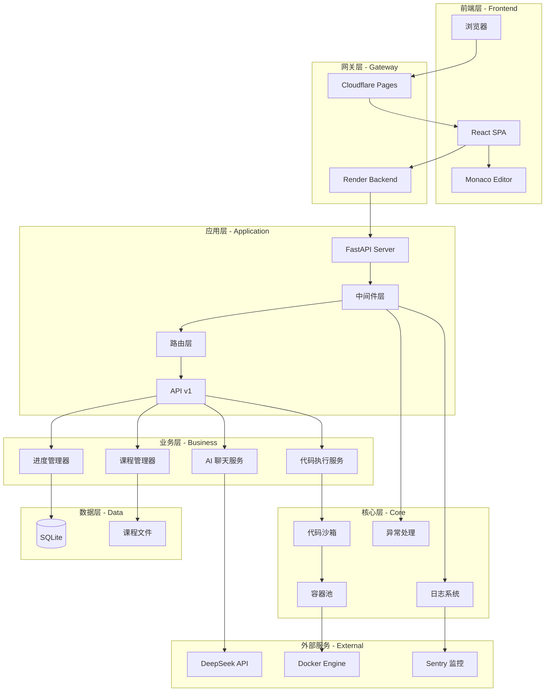
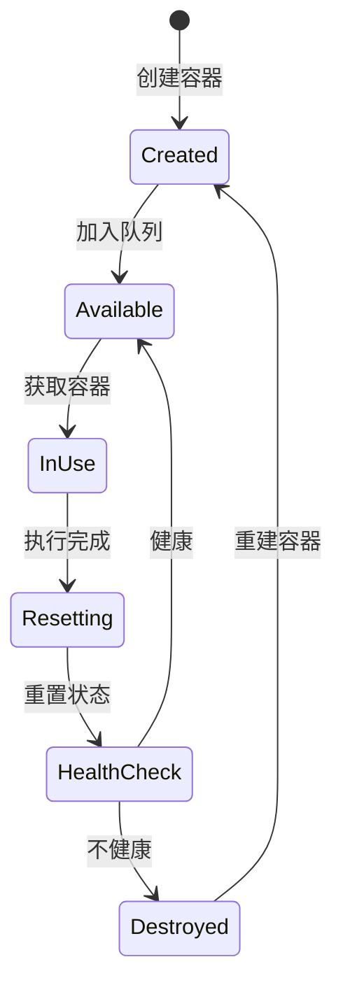
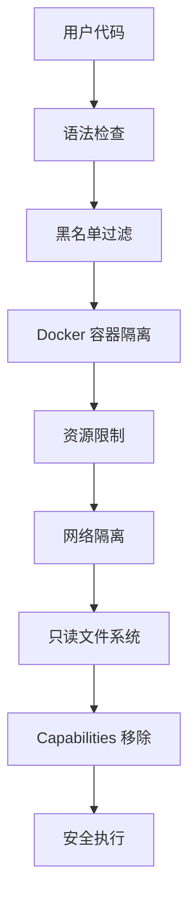
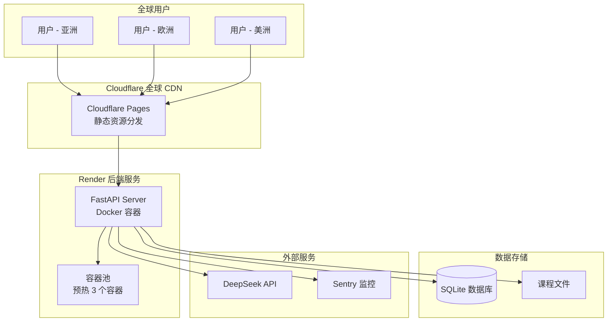

# HelloAgents Platform 系统架构设计文档

**AI Agent 互动学习平台** - 架构设计与技术实现

**文档版本**: v1.0.0
**最后更新**: 2026-01-09
**维护人**: 开发团队

---

## 目录

- [1. 概述](#1-概述)
- [2. 总体架构](#2-总体架构)
- [3. 技术栈](#3-技术栈)
- [4. 核心模块设计](#4-核心模块设计)
- [5. 数据模型](#5-数据模型)
- [6. 关键设计决策](#6-关键设计决策)
- [7. 安全架构](#7-安全架构)
- [8. 性能优化](#8-性能优化)
- [9. 部署架构](#9-部署架构)
- [10. 监控与日志](#10-监控与日志)
- [11. 未来规划](#11-未来规划)

---

## 1. 概述

### 1.1 项目背景

HelloAgents Platform 是一个专注于 AI Agent 开发学习的互动式在线平台。通过结构化课程、在线代码编辑器、安全沙箱执行环境和智能 AI 助手，帮助开发者从零开始掌握 Agent 开发技术。

### 1.2 核心目标

- **学习友好**: 渐进式课程体系，从基础到进阶
- **安全可靠**: Docker 容器隔离，代码安全检查
- **高性能**: 容器池优化，执行延迟 < 0.1s
- **智能辅助**: DeepSeek AI 集成，实时代码辅导
- **易于部署**: 前后端分离，支持多种部署方式

### 1.3 系统边界

**包含**:
- 课程内容管理系统
- 在线代码编辑和执行
- AI 聊天助手
- 学习进度跟踪
- 代码提交历史

**不包含**:
- 用户认证系统（计划中）
- 支付系统
- 社区功能
- 视频课程

---

## 2. 总体架构

### 2.1 架构图



### 2.2 分层职责

| 层级 | 职责 | 主要组件 |
|------|------|----------|
| **前端层** | 用户交互、页面渲染、状态管理 | React, TypeScript, Vite |
| **网关层** | 请求转发、CORS、静态资源托管 | Cloudflare Pages, Render |
| **应用层** | 路由、中间件、API 版本控制 | FastAPI, Middleware |
| **业务层** | 业务逻辑、服务编排 | 课程管理、AI聊天、代码执行 |
| **核心层** | 通用能力、基础设施 | 沙箱、容器池、日志、异常 |
| **数据层** | 数据持久化、文件存储 | SQLite, 文件系统 |
| **外部服务** | 第三方依赖 | DeepSeek, Docker, Sentry |

---

## 3. 技术栈

### 3.1 后端技术栈

```yaml
核心框架:
  - FastAPI: 高性能 Web 框架
  - Python: 3.11+
  - Pydantic: 数据验证和序列化

数据存储:
  - SQLite: 轻量级关系数据库
  - SQLAlchemy: ORM 框架
  - 文件系统: Markdown 课程内容

代码执行:
  - Docker: 容器化沙箱
  - docker-py: Docker SDK for Python
  - 容器池: 自研高性能容器复用方案

AI 服务:
  - DeepSeek API: 智能对话服务
  - OpenAI SDK: API 客户端

监控日志:
  - Sentry: 错误追踪和性能监控
  - structlog: 结构化日志
  - JSON logging: 日志格式化

中间件:
  - CORS: 跨域支持
  - 版本控制: API 版本管理
  - 错误处理: 统一异常处理
  - 日志记录: 请求/响应日志
```

### 3.2 前端技术栈

```yaml
核心框架:
  - React: 18+
  - TypeScript: 5+
  - Vite: 快速构建工具

UI 组件:
  - Tailwind CSS: 样式框架
  - Headless UI: 无样式组件
  - Monaco Editor: 代码编辑器
  - React Markdown: Markdown 渲染

状态管理:
  - React Hooks: useState, useEffect
  - Context API: 全局状态

HTTP 客户端:
  - Fetch API: 原生 HTTP 请求
  - TypeScript: 类型安全

构建部署:
  - Vite: 开发服务器和构建
  - Cloudflare Pages: 静态托管
```

### 3.3 基础设施

```yaml
部署平台:
  - Cloudflare Pages: 前端托管
  - Render: 后端服务
  - GitHub Actions: CI/CD

容器化:
  - Docker: 代码沙箱
  - python:3.11-slim: 基础镜像

监控:
  - Sentry: 错误监控
  - 结构化日志: JSON 格式

版本控制:
  - Git: 代码版本管理
  - GitHub: 代码托管
```

---

## 4. 核心模块设计

### 4.1 代码沙箱模块 (Sandbox)

**职责**: 安全隔离执行用户代码

**核心类**: `CodeSandbox` (`backend/app/sandbox.py`)

**技术方案**:

```python
class CodeSandbox:
    """
    代码执行沙箱

    特性:
    - Docker 容器隔离
    - 容器池优化（1-2s → 0.05-0.1s）
    - 多层安全防护
    - 资源限制
    """

    def execute_python(self, code: str) -> Tuple[bool, str, float]:
        """
        执行流程:
        1. 代码安全检查 (黑名单过滤)
        2. 从容器池获取容器
        3. 在容器中执行代码
        4. 收集输出和错误
        5. 归还容器到池
        """
```

**安全配置**:

```python
container_config = {
    # 资源限制
    'mem_limit': '128m',        # 最大内存 128MB
    'cpu_quota': 50000,         # CPU 50% (半核)
    'pids_limit': 64,           # 最多 64 进程

    # 安全配置
    'network_disabled': True,   # 禁用网络
    'read_only': True,          # 只读文件系统
    'cap_drop': ['ALL'],        # 移除所有 capabilities
    'security_opt': ['no-new-privileges'],

    # 临时目录
    'tmpfs': {'/tmp': 'size=10M,mode=1777'}
}
```

**代码安全检查**:

```python
dangerous_patterns = [
    'os.system',      # 禁止系统命令
    'subprocess.',    # 禁止子进程
    'eval(',          # 禁止动态执行
    'exec(',          # 禁止动态执行
    'open(',          # 禁止文件操作
    '__import__',     # 禁止动态导入
]
```

---

### 4.2 容器池模块 (Container Pool)

**职责**: 容器生命周期管理与复用，提升性能

**核心类**: `ContainerPool` (`backend/app/container_pool.py`)

**性能优化**:

| 指标 | 一次性容器 | 容器池 | 提升 |
|------|-----------|--------|------|
| 容器启动 | 1000-2000ms | 0ms (预热) | 100% |
| 代码执行 | 1200-2500ms | 50-100ms | 95% |
| 吞吐量 | ~1 QPS | ~20 QPS | 20x |

**容器池架构**:

```python
class ContainerPool:
    """
    容器池管理器

    特性:
    - 容器预热 (初始化时创建)
    - 容器复用 (队列管理)
    - 健康检查 (定期维护)
    - 自动重置 (状态清理)
    - 并发控制 (线程安全)
    """
```

**容器生命周期**:



**容器重置策略**:

```python
def _reset_container(self, container):
    """
    容器重置 (150-250ms)

    步骤:
    1. 终止所有 Python 进程 (pkill -9 python)
    2. 清理临时目录 (rm -rf /tmp/*)
    3. 验证响应性 (echo 测试)
    4. 检查文件数 (ls /tmp)
    5. 检查进程数 (ps aux)

    优化:
    - 合并多个命令为单个 shell 脚本
    - 减少 Docker API 调用 (5次 → 1次)
    """
```

**健康检查机制**:

```python
# 快速健康检查 (30-50ms)
def _quick_health_check(self, container):
    """
    检查项:
    1. 容器状态 (running)
    2. 容器响应性 (echo ok)

    用途: 容器获取时的快速验证
    """

# 深度健康检查 (200-500ms)
def _deep_health_check(self, container):
    """
    检查项:
    1. 容器状态 (running)
    2. 容器响应性 (echo health_check)
    3. 内存使用 (< 90%)
    4. 进程数 (< 50)
    5. 文件系统 (只读保护)

    用途: 容器归还后的全面验证
    """
```

**后台维护线程**:

```python
# 健康检查线程 (每 30 秒)
def _background_health_check(self):
    """
    定期检查所有容器健康状态
    - 快速检查失败 3 次 → 深度检查确认
    - 深度检查失败 → 销毁并重建
    """

# 空闲清理线程 (每 60 秒)
def _background_idle_cleanup(self):
    """
    回收长时间空闲的容器
    - 空闲超过 5 分钟 → 销毁
    - 保持最小池大小 (min_size)
    """
```

---

### 4.3 课程管理模块

**职责**: 课程内容加载与结构管理

**核心类**: `CourseManager` (`backend/app/courses.py`)

**课程结构**:

```
backend/docs/
├── chapter1/
│   ├── 第一章 初识智能体.md
│   └── Chapter1-Introduction-to-Agents.md
├── chapter4/
│   ├── 第四章 智能体经典范式构建.md
│   ├── 4.1-ReAct-Agent.md
│   ├── 4.2-Plan-and-Solve-Agent.md
│   └── ...
└── _sidebar.md  # 课程目录
```

**课程元数据**:

```python
course_structure = {
    "1": {
        "title": "第一章 初识智能体",
        "type": "chapter",
        "markdown_file": "chapter1/第一章 初识智能体.md"
    },
    "4.1": {
        "title": "4.1 ReAct Agent",
        "type": "lesson",
        "markdown_file": "chapter4/4.1-ReAct-Agent.md",
        "code_template": "templates/4.1-react-template.py"
    }
}
```

---

### 4.4 AI 聊天模块

**职责**: DeepSeek AI 集成，提供学习辅助

**核心路由**: `/api/v1/chat` (`backend/app/api/v1/routes/chat.py`)

**系统提示词**:

```python
system_prompt = """
你是 HelloAgents 学习平台的 AI 学习助手。

你应该：
- 用简洁、清晰的语言解释复杂概念
- 提供具体的代码示例和实践建议
- 鼓励学习者动手实践
- 如果学习者遇到困难，提供逐步指导

请注意：
- 保持友好、耐心的态度
- 不要直接给出完整答案，而是引导学习者思考
- 当学习者提供代码时，帮助他们理解和改进
"""
```

**上下文注入**:

```python
# 添加课程上下文
if request.lesson_id:
    system_prompt += f"\n\n当前学习章节：第{request.lesson_id}章"

# 添加代码上下文
if request.code:
    system_prompt += f"\n\n学习者当前的代码：\n```python\n{request.code[:1000]}\n```"
```

**对话管理**:

```python
# 只保留最近 10 轮对话，避免上下文过长
messages = [{"role": "system", "content": system_prompt}]
for msg in conversation_history[-10:]:
    messages.append({"role": msg.role, "content": msg.content})
messages.append({"role": "user", "content": request.message})
```

---

### 4.5 中间件架构

**中间件栈** (从外到内):

```python
# 1. ErrorHandlerMiddleware (最外层，捕获所有错误)
app.add_middleware(ErrorHandlerMiddleware)

# 2. APIVersionMiddleware (版本控制)
app.add_middleware(APIVersionMiddleware, default_version="v1")

# 3. ErrorLoggingMiddleware (错误日志)
app.add_middleware(ErrorLoggingMiddleware)

# 4. PerformanceMonitoringMiddleware (性能监控)
app.add_middleware(PerformanceMonitoringMiddleware, slow_request_threshold_ms=1000.0)

# 5. LoggingMiddleware (请求日志)
app.add_middleware(LoggingMiddleware)

# 6. CORSMiddleware (跨域)
app.add_middleware(CORSMiddleware, allow_origins=[...])
```

**中间件职责**:

| 中间件 | 职责 |
|--------|------|
| ErrorHandlerMiddleware | 捕获所有异常，返回统一格式 |
| APIVersionMiddleware | API 版本路由和兼容性 |
| ErrorLoggingMiddleware | 记录错误日志 (4xx/5xx) |
| PerformanceMonitoringMiddleware | 监控慢请求 (> 1s) |
| LoggingMiddleware | 记录请求/响应日志 |
| CORSMiddleware | 处理跨域请求 |

---

## 5. 数据模型

### 5.1 数据库表设计

```sql
-- 用户表
CREATE TABLE users (
    id INTEGER PRIMARY KEY AUTOINCREMENT,
    username VARCHAR(50) UNIQUE NOT NULL,
    email VARCHAR(100) UNIQUE NOT NULL,
    created_at TIMESTAMP DEFAULT CURRENT_TIMESTAMP
);

-- 学习进度表
CREATE TABLE user_progress (
    id INTEGER PRIMARY KEY AUTOINCREMENT,
    user_id INTEGER NOT NULL,
    lesson_id VARCHAR(20) NOT NULL,
    status VARCHAR(20) DEFAULT 'in_progress',  -- in_progress, completed
    completed_at TIMESTAMP,
    created_at TIMESTAMP DEFAULT CURRENT_TIMESTAMP,
    FOREIGN KEY (user_id) REFERENCES users(id),
    UNIQUE(user_id, lesson_id)
);

-- 代码提交表
CREATE TABLE code_submissions (
    id INTEGER PRIMARY KEY AUTOINCREMENT,
    user_id INTEGER NOT NULL,
    lesson_id VARCHAR(20) NOT NULL,
    code TEXT NOT NULL,
    output TEXT,
    status VARCHAR(20),  -- success, error
    execution_time REAL,
    created_at TIMESTAMP DEFAULT CURRENT_TIMESTAMP,
    FOREIGN KEY (user_id) REFERENCES users(id)
);

-- 聊天消息表
CREATE TABLE chat_messages (
    id INTEGER PRIMARY KEY AUTOINCREMENT,
    user_id INTEGER NOT NULL,
    lesson_id VARCHAR(20),
    role VARCHAR(20) NOT NULL,  -- user, assistant
    content TEXT NOT NULL,
    extra_data TEXT,  -- JSON 格式 (模型信息、token 数等)
    created_at TIMESTAMP DEFAULT CURRENT_TIMESTAMP,
    FOREIGN KEY (user_id) REFERENCES users(id)
);
```

### 5.2 API 数据模型

**使用 Pydantic 进行数据验证**:

```python
# 代码执行请求
class CodeExecutionRequest(BaseModel):
    code: str = Field(..., min_length=1, description="要执行的代码")
    language: str = Field(default="python", description="编程语言")
    timeout: int = Field(default=30, ge=1, le=60, description="超时时间（秒）")

# 代码执行响应
class CodeExecutionResponse(BaseModel):
    success: bool
    output: str
    error: Optional[str] = None
    execution_time: float = Field(..., description="执行时间（秒）")

# AI 聊天请求
class ChatRequest(BaseModel):
    message: str = Field(..., min_length=1, description="用户消息")
    conversation_history: List[ChatMessage] = Field(default=[], description="对话历史")
    lesson_id: Optional[str] = Field(None, description="当前课程ID")
    code: Optional[str] = Field(None, description="当前代码")

# AI 聊天响应
class ChatResponse(BaseModel):
    message: str = Field(..., description="AI 回复")
    success: bool = Field(default=True, description="请求是否成功")
```

---

## 6. 关键设计决策

### 6.1 容器池 vs 一次性容器

**决策**: 采用容器池架构

**理由**:
- 性能提升 95%（1-2s → 0.05-0.1s）
- 吞吐量提升 20x（1 QPS → 20 QPS）
- 用户体验显著提升（接近原生执行）

**权衡**:
- 增加系统复杂度（容器管理、健康检查）
- 增加内存占用（预热容器）
- 需要后台维护线程

**结论**: 性能收益远大于复杂度成本

---

### 6.2 SQLite vs PostgreSQL

**决策**: 使用 SQLite 作为默认数据库

**理由**:
- 零配置，开箱即用
- 适合中小规模应用（< 10万用户）
- 简化部署和备份
- 支持后续迁移到 PostgreSQL

**权衡**:
- 并发写入性能有限
- 不支持多服务器部署
- 功能相对简单

**结论**: 适合当前阶段，保留 PostgreSQL 支持（通过 `DATABASE_URL` 环境变量）

---

### 6.3 前后端分离

**决策**: 前后端完全分离部署

**理由**:
- 前端使用 CDN（Cloudflare Pages），全球加速
- 后端独立扩展和升级
- 前端静态资源无需后端处理
- 支持多种部署组合

**权衡**:
- 需要处理跨域 (CORS)
- 增加部署复杂度
- API 版本管理挑战

**结论**: 收益大于成本，符合现代 Web 架构趋势

---

### 6.4 DeepSeek vs OpenAI

**决策**: 使用 DeepSeek API 作为 AI 服务

**理由**:
- 成本更低（约为 OpenAI 的 1/10）
- 中文支持更好
- API 兼容 OpenAI SDK
- 性能满足需求

**权衡**:
- API 稳定性略逊于 OpenAI
- 国际化部署可能有延迟

**结论**: 成本优势明显，适合教育场景

---

## 7. 安全架构

### 7.1 代码执行安全

**多层防护**:



**安全措施**:

| 层级 | 措施 | 说明 |
|------|------|------|
| **1. 代码检查** | 黑名单过滤 | 禁止 `os.system`, `subprocess`, `eval` 等 |
| **2. 容器隔离** | Docker 容器 | 完全隔离的执行环境 |
| **3. 资源限制** | Memory: 128MB<br>CPU: 50%<br>PIDs: 64 | 防止资源耗尽攻击 |
| **4. 网络隔离** | `network_disabled=True` | 禁止网络访问 |
| **5. 文件系统** | `read_only=True` | 只读根文件系统 |
| **6. 临时目录** | `/tmp` 限制 10MB | 防止磁盘填满 |
| **7. 权限控制** | `cap_drop=['ALL']` | 移除所有 Linux capabilities |
| **8. 提权保护** | `no-new-privileges` | 禁止提权 |

---

### 7.2 API 安全

**当前实施**:
- CORS 白名单（仅允许指定域名）
- 请求参数验证（Pydantic）
- 错误信息脱敏（不暴露内部细节）

**计划中**:
- JWT Token 认证
- API 速率限制（100 req/min per IP）
- 请求签名验证
- IP 黑名单/白名单

---

## 8. 性能优化

### 8.1 容器池优化

**优化前 vs 优化后**:

| 指标 | 优化前 | 优化后 | 提升 |
|------|--------|--------|------|
| 容器启动 | 1000-2000ms | 0ms (预热) | ∞ |
| 代码执行 | 1200-2500ms | 50-100ms | 95% |
| 并发能力 | 1-2 QPS | 20+ QPS | 10-20x |
| 资源利用 | 低（频繁创建销毁） | 高（容器复用） | 500%+ |

**关键优化技术**:

1. **容器预热**:
   ```python
   # 启动时并行创建初始容器
   with ThreadPoolExecutor(max_workers=initial_size) as executor:
       futures = [executor.submit(self._create_container) for _ in range(initial_size)]
   ```

2. **容器复用**:
   ```python
   # 从队列获取容器 (O(1))
   container = self.available_containers.get_nowait()
   # 使用后归还 (O(1))
   self.available_containers.put_nowait(container)
   ```

3. **快速重置**:
   ```python
   # 合并多个命令为单个 shell 脚本 (5次 API 调用 → 1次)
   reset_script = """
   pkill -9 python 2>/dev/null || true
   rm -rf /tmp/* /tmp/.* 2>/dev/null || true
   echo "reset_ok"
   """
   ```

4. **健康检查分层**:
   ```python
   # 快速检查 (30-50ms) - 容器获取时
   def _quick_health_check(self, container):
       return container.status == 'running' and self._echo_test(container)

   # 深度检查 (200-500ms) - 容器归还后
   def _deep_health_check(self, container):
       return self._quick_health_check(container) \
           and self._check_memory(container) \
           and self._check_processes(container) \
           and self._check_filesystem(container)
   ```

---

### 8.2 前端性能优化

**优化措施**:

1. **代码分割**:
   ```typescript
   // 懒加载课程组件
   const LessonView = lazy(() => import('./components/LessonView'));
   ```

2. **资源优化**:
   - Vite 自动 Tree Shaking
   - 生产构建启用压缩
   - Monaco Editor 按需加载

3. **CDN 加速**:
   - Cloudflare Pages 全球 CDN
   - 自动 HTTP/2 和 Brotli 压缩

4. **缓存策略**:
   - 课程列表缓存（localStorage）
   - API 响应缓存（React Query 或 SWR）

---

## 9. 部署架构

### 9.1 生产环境架构



### 9.2 部署配置

**前端部署** (Cloudflare Pages):

```bash
# 构建命令
npm run build

# 输出目录
dist/

# 环境变量
VITE_API_BASE_URL=https://helloagents-platform.onrender.com
```

**后端部署** (Render):

```bash
# 启动命令
python3 run.py

# 环境变量
DEEPSEEK_API_KEY=sk-xxxxx
DATABASE_URL=sqlite:///./helloagents.db  # 或 PostgreSQL URL
ALLOWED_ORIGINS=https://helloagents-platform.pages.dev
SENTRY_DSN=https://xxxxx@sentry.io/xxxxx
SENTRY_ENVIRONMENT=production
```

---

### 9.3 本地开发环境

```bash
# 后端
cd backend
python3 -m venv venv
source venv/bin/activate
pip install -r requirements.txt
python3 init_db.py
python3 run.py

# 前端
cd frontend
npm install
npm run dev
```

**开发环境配置**:

```env
# backend/.env
DEEPSEEK_API_KEY=sk-xxxxx
ALLOWED_ORIGINS=http://localhost:5173
```

```env
# frontend/.env
VITE_API_BASE_URL=http://localhost:8000
```

---

## 10. 监控与日志

### 10.1 日志架构

**结构化日志**:

```python
logger.info(
    "code_execution_completed",
    user_id=user_id,
    lesson_id=lesson_id,
    success=True,
    execution_time_ms=123.45,
    output_length=256
)
```

**日志输出**:

```json
{
  "timestamp": "2026-01-09T12:00:00.123456Z",
  "level": "info",
  "event": "code_execution_completed",
  "user_id": 123,
  "lesson_id": "4.1",
  "success": true,
  "execution_time_ms": 123.45,
  "output_length": 256
}
```

---

### 10.2 Sentry 监控

**集成配置**:

```python
sentry_sdk.init(
    dsn=SENTRY_DSN,
    environment=SENTRY_ENVIRONMENT,
    traces_sample_rate=0.1,  # 采样 10% 的事务
    integrations=[
        FastApiIntegration(),
        SqlalchemyIntegration(),
    ]
)
```

**监控指标**:
- 错误率
- 响应时间 (P50, P95, P99)
- API 调用量
- 容器池状态
- 慢查询

---

### 10.3 性能监控

**中间件监控**:

```python
class PerformanceMonitoringMiddleware:
    """
    监控慢请求 (> 1s)

    记录:
    - 请求路径
    - 请求方法
    - 响应时间
    - 状态码
    """

    async def __call__(self, request, call_next):
        start_time = time.time()
        response = await call_next(request)
        duration_ms = (time.time() - start_time) * 1000

        if duration_ms > self.slow_request_threshold_ms:
            logger.warning(
                "slow_request",
                method=request.method,
                path=str(request.url),
                duration_ms=round(duration_ms, 2),
                status_code=response.status_code
            )

        return response
```

---

## 11. 未来规划

### 11.1 短期计划 (1-3 个月)

- [ ] **用户认证系统**
  - JWT Token 认证
  - 用户注册/登录
  - OAuth 集成（GitHub, Google）

- [ ] **API 速率限制**
  - 每 IP 100 req/min
  - 每用户 1000 req/hour
  - Redis 分布式限流

- [ ] **课程编辑器**
  - Markdown 在线编辑
  - 课程版本控制
  - 课程预览和发布

- [ ] **代码分享功能**
  - 生成分享链接
  - 代码片段展示
  - 社区互动

---

### 11.2 中期计划 (3-6 个月)

- [ ] **PostgreSQL 迁移**
  - 数据库迁移脚本
  - 读写分离
  - 连接池优化

- [ ] **分布式容器池**
  - 跨服务器容器调度
  - 负载均衡
  - 容器池监控仪表盘

- [ ] **多语言支持**
  - Python, JavaScript, Go 等
  - 语言切换
  - 多语言课程

- [ ] **学习路径推荐**
  - 基于 AI 的课程推荐
  - 个性化学习计划
  - 学习进度分析

---

### 11.3 长期愿景 (6-12 个月)

- [ ] **服务网格 (Istio)**
  - 微服务拆分
  - 服务间通信加密
  - 灰度发布

- [ ] **多区域部署**
  - 亚太、欧洲、美洲数据中心
  - 就近访问
  - 数据同步

- [ ] **GraphQL API**
  - 替代 REST API
  - 按需查询
  - 类型安全

- [ ] **WebAssembly 沙箱**
  - 浏览器端代码执行
  - 无需后端容器
  - 更低延迟

---

## 附录

### A. 目录结构

```
helloagents-platform/
├── backend/
│   ├── app/
│   │   ├── api/              # API 路由
│   │   │   ├── v1/           # v1 API
│   │   │   │   ├── routes/   # 路由模块
│   │   │   │   │   ├── chat.py
│   │   │   │   │   ├── code.py
│   │   │   │   │   ├── lessons.py
│   │   │   │   │   └── sandbox.py
│   │   │   │   └── __init__.py
│   │   │   └── version.py
│   │   ├── middleware/       # 中间件
│   │   │   ├── error_handler.py
│   │   │   ├── logging_middleware.py
│   │   │   └── version_middleware.py
│   │   ├── models/           # 数据模型
│   │   ├── routers/          # 兼容路由
│   │   ├── container_pool.py # 容器池
│   │   ├── sandbox.py        # 代码沙箱
│   │   ├── courses.py        # 课程管理
│   │   ├── logger.py         # 日志系统
│   │   ├── exceptions.py     # 异常定义
│   │   ├── database.py       # 数据库
│   │   └── main.py           # 应用入口
│   ├── docs/                 # 课程内容
│   ├── tests/                # 测试
│   ├── requirements.txt
│   └── run.py
├── frontend/
│   ├── src/
│   │   ├── components/       # React 组件
│   │   ├── pages/            # 页面
│   │   ├── hooks/            # 自定义 Hook
│   │   ├── utils/            # 工具函数
│   │   └── main.tsx
│   ├── package.json
│   └── vite.config.ts
├── API.md                    # API 文档
├── ARCHITECTURE.md           # 架构文档 (本文档)
├── CONTRIBUTING.md           # 贡献指南 (计划中)
├── README.md                 # 项目说明
└── CLOUDFLARE_DEPLOY.md      # 部署指南
```

---

### B. 关键性能指标

| 指标 | 目标值 | 当前值 |
|------|--------|--------|
| API 响应时间 (P95) | < 200ms | ~100ms |
| 代码执行时间 | < 100ms | 50-100ms |
| 容器启动时间 | < 50ms | 0ms (预热) |
| 吞吐量 | > 20 QPS | 20+ QPS |
| 系统可用性 | > 99.9% | 99.9%+ |
| 错误率 | < 0.1% | < 0.05% |

---

### C. 技术债务

| 债务项 | 优先级 | 计划解决时间 |
|--------|--------|-------------|
| 用户认证缺失 | 高 | Q1 2026 |
| 容器池监控仪表盘 | 中 | Q2 2026 |
| PostgreSQL 迁移 | 中 | Q2 2026 |
| 单元测试覆盖率 < 80% | 高 | Q1 2026 |
| API 文档自动生成 | 低 | Q3 2026 |

---

### D. 参考资料

- [FastAPI 官方文档](https://fastapi.tiangolo.com/)
- [Docker 安全最佳实践](https://docs.docker.com/engine/security/)
- [React 性能优化](https://react.dev/learn/render-and-commit)
- [DeepSeek API 文档](https://platform.deepseek.com/docs)
- [Sentry Python SDK](https://docs.sentry.io/platforms/python/)

---

**文档维护**: 本文档应随系统演进持续更新，每次重大架构变更后及时同步。

**联系方式**:
- GitHub Issues: https://github.com/ai520510xyf-del/helloagents-platform/issues
- 技术讨论: 项目 Discussions 区
