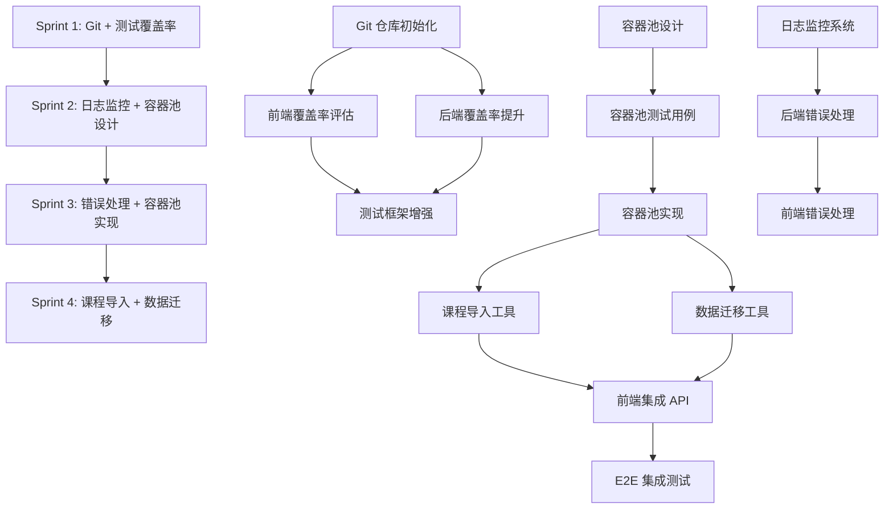

# HelloAgents Platform - Sprint 执行计划

**制定日期**: 2026-01-08
**制定人**: Technical Project Manager
**基于**: Technical Architect 技术决策（2026-01-08）
**规划周期**: 4周（Sprint 1-4）
**团队规模**: 5人核心 + 3人顾问

---

## 执行摘要

基于 Technical Architect 的 6 个关键决策和 4 周路线图，本计划将任务分解为 4 个 Sprint（每个 Sprint 1 周），明确任务分配、依赖关系、里程碑和风险控制。

### 关键决策落地

| 决策主题 | Architect 建议 | 执行方案 |
|---------|---------------|---------|
| 测试覆盖率 | 先评估前端，后统一80% | Sprint 1: 前端评估 → Sprint 2: 后端提升 |
| Sandbox | 分阶段实施容器池 | Sprint 2: 测试 → Sprint 3: 容器池 |
| Phase 2优先级 | Git → 测试 → 日志监控 → 容器池 | Sprint 1: Git → Sprint 2-3: 测试 + 日志 |
| Git仓库 | 立即初始化 | Sprint 1 Day 1（最高优先级）|
| 状态管理 | 保留Zustand，API集成时引入 | Sprint 3-4: 数据库集成时实施 |
| 技术债务 | 分层偿还（P0→P1→P2）| 严格按优先级执行 |

### 4周里程碑

```
Week 1 (Sprint 1): Git仓库初始化 + 前端覆盖率评估 + 后端覆盖率提升
Week 2 (Sprint 2): 日志监控系统 + 容器池基础设计
Week 3 (Sprint 3): 错误处理统一 + API版本控制 + 容器池实现
Week 4 (Sprint 4): 课程导入工具 + 数据迁移 + 集成测试
```

---

## Sprint 1: Git 初始化 + 测试覆盖率提升 (Week 1)

### Sprint 目标
1. 完成 Git 仓库初始化和 GitHub 远程配置
2. 评估前端测试覆盖率并生成报告
3. 提升后端测试覆盖率从 77% → 80%+
4. 完成沙箱和 Chat API 的核心测试用例

### 任务分解

#### Task 1.1: Git 仓库初始化（P0 - Critical）
**负责人**: DevOps Engineer
**协助**: Technical Project Manager
**工作量**: 0.5 天
**优先级**: P0（最高）

**子任务**:
- [ ] 1.1.1 初始化 Git 仓库（`git init`）
- [ ] 1.1.2 创建 `.gitignore` 文件（排除 `node_modules/`, `*.db`, `__pycache__/`, `.env`）
- [ ] 1.1.3 创建 GitHub 远程仓库
- [ ] 1.1.4 添加远程仓库并推送（`git remote add origin ...`）
- [ ] 1.1.5 创建 `main` 分支保护规则
- [ ] 1.1.6 创建 `develop` 分支（日常开发）
- [ ] 1.1.7 配置 Git Hooks（pre-commit: 代码格式化）
- [ ] 1.1.8 编写 `CONTRIBUTING.md` 贡献指南

**产出**:
- Git 仓库已初始化
- GitHub 远程仓库已配置
- 分支策略文档（Git Flow）
- `.gitignore` 文件

**验收标准**:
```bash
git status  # 显示正常
git remote -v  # 显示 origin
git log  # 显示初始提交
```

**风险**:
- 低风险（标准操作）
- 注意不要提交敏感文件（`.env`, `*.db`）

---

#### Task 1.2: 前端测试覆盖率评估（P0）
**负责人**: Senior Frontend Developer
**协助**: QA Automation Engineer
**工作量**: 1 天
**优先级**: P0

**子任务**:
- [ ] 1.2.1 运行前端测试并生成覆盖率报告（`npm run test:coverage`）
- [ ] 1.2.2 分析覆盖率数据（按文件/组件分类）
- [ ] 1.2.3 识别未覆盖的关键代码
- [ ] 1.2.4 生成覆盖率报告文档（`/reports/前端测试覆盖率报告_2026-01-08.md`）
- [ ] 1.2.5 与后端覆盖率对比，确定统一目标（80%）

**产出**:
- 前端测试覆盖率报告（HTML + Markdown）
- 未覆盖代码清单
- 覆盖率提升计划

**验收标准**:
- 覆盖率报告生成成功
- 报告包含具体数据（行覆盖率、分支覆盖率、函数覆盖率）
- 识别出需要补充测试的关键组件

**依赖**:
- 前端测试框架已搭建（Vitest + React Testing Library）

---

#### Task 1.3: 后端测试覆盖率提升（P0）
**负责人**: Senior Backend Developer
**协助**: QA Automation Engineer
**工作量**: 2.5 天
**优先级**: P0

**子任务**:
- [ ] 1.3.1 分析当前覆盖率报告，识别优先级
  - `app/main.py` (68%) → 补充 `/api/chat` 测试
  - `app/sandbox.py` (54%) → 补充安全检查和容器管理测试
  - `app/database.py` (50%) → 补充数据库工具函数测试
- [ ] 1.3.2 编写 Chat API 测试用例（`/api/chat` 端点）
  - 测试成功对话流程
  - 测试错误处理（API key 错误、网络错误）
  - 测试流式响应（SSE）
- [ ] 1.3.3 编写沙箱安全检查测试用例
  - 测试黑名单代码拦截（`os.system`, `eval`, `exec`）
  - 测试资源限制（内存、CPU、进程数）
  - 测试输出截断功能
  - 测试容器清理机制
- [ ] 1.3.4 编写数据库工具函数测试用例
  - 测试 `get_db_stats()`
  - 测试 `init_db()` 和 `drop_all_tables()`
  - 测试 `recreate_db()`
- [ ] 1.3.5 运行测试并验证覆盖率达到 80%+

**产出**:
- 新增测试用例文件：
  - `backend/tests/test_chat_api.py`（Chat API 测试）
  - `backend/tests/test_sandbox_security.py`（沙箱安全测试）
  - `backend/tests/test_database_utils.py`（数据库工具测试）
- 覆盖率报告（77% → 80%+）

**验收标准**:
```bash
cd backend
pytest --cov=app --cov-report=html --cov-report=term
# 总覆盖率 >= 80%
# app/main.py >= 80%
# app/sandbox.py >= 70%
# app/database.py >= 70%
```

**风险**:
- 中等风险：Chat API 测试需要 Mock DeepSeek API（避免真实调用）
- 中等风险：沙箱测试需要 Docker 环境

**技术难点**:
- Mock SSE 流式响应
- Mock Docker API 调用

---

#### Task 1.4: 测试框架增强（P1）
**负责人**: QA Automation Engineer
**协助**: Frontend Lead + Backend Lead
**工作量**: 1 天
**优先级**: P1

**子任务**:
- [ ] 1.4.1 配置 pytest-cov 高级选项（排除测试文件本身）
- [ ] 1.4.2 配置 Vitest 覆盖率阈值（`coverage.thresholds`）
- [ ] 1.4.3 创建测试命令快捷方式（`npm run test:watch`, `npm run test:ui`）
- [ ] 1.4.4 配置 CI 自动化测试（GitHub Actions）
- [ ] 1.4.5 设置覆盖率报告自动上传（Codecov/Coveralls）

**产出**:
- `.github/workflows/test.yml`（CI 配置）
- 更新 `package.json` 和 `pyproject.toml`（测试命令）
- Codecov/Coveralls 集成

**验收标准**:
- 每次 Push/PR 自动运行测试
- 覆盖率报告自动生成并展示

---

### Sprint 1 时间分配

| 日期 | 任务 | 负责人 | 状态 |
|-----|------|--------|------|
| Day 1 AM | Task 1.1: Git 仓库初始化 | DevOps | Pending |
| Day 1 PM | Task 1.2: 前端覆盖率评估 | Frontend Lead | Pending |
| Day 2-3 | Task 1.3: 后端覆盖率提升 | Backend Lead | Pending |
| Day 4 | Task 1.4: 测试框架增强 | QA Automation | Pending |
| Day 5 | Sprint Review + Retrospective | All | Pending |

### Sprint 1 里程碑
- **Git 仓库**: 已初始化，已推送到 GitHub
- **前端覆盖率**: 已评估，生成报告
- **后端覆盖率**: 从 77% → 80%+
- **测试框架**: CI 自动化已配置

### Sprint 1 风险管理

| 风险 | 影响 | 概率 | 应对策略 |
|------|------|------|---------|
| Git 初始化失败 | 高 | 低 | 提前准备 GitHub Token |
| Chat API Mock 困难 | 中 | 中 | 使用 `pytest-mock` 或 `responses` 库 |
| Docker 环境问题 | 中 | 低 | 本地验证 Docker 版本 |
| 覆盖率无法达标 | 中 | 中 | 调整目标为 78%（先完成核心测试）|

---

## Sprint 2: 日志监控 + 容器池设计 (Week 2)

### Sprint 目标
1. 实现统一的日志监控系统（structlog + Sentry）
2. 设计并验证容器池架构（POC）
3. 完成容器池测试用例
4. 补充前端测试用例（如需要）

### 任务分解

#### Task 2.1: 日志监控系统实现（P0）
**负责人**: Senior Backend Developer
**协助**: DevOps Engineer
**工作量**: 2 天
**优先级**: P0

**子任务**:
- [ ] 2.1.1 安装依赖（`structlog`, `sentry-sdk`）
- [ ] 2.1.2 配置 structlog（结构化日志）
  - JSON 格式输出
  - 时间戳、请求ID、用户ID
  - 日志级别（DEBUG/INFO/WARNING/ERROR）
- [ ] 2.1.3 创建日志中间件（FastAPI）
  - 记录所有 API 请求/响应
  - 记录执行时间
  - 记录错误堆栈
- [ ] 2.1.4 集成 Sentry 错误追踪
  - 生产环境自动上报错误
  - 本地环境仅记录日志
- [ ] 2.1.5 添加日志到关键代码路径
  - 沙箱执行前后
  - AI API 调用前后
  - 数据库操作前后
- [ ] 2.1.6 配置日志轮转（`logging.handlers.RotatingFileHandler`）

**产出**:
- `backend/app/logger.py`（日志配置）
- `backend/app/middleware/logging_middleware.py`（日志中间件）
- Sentry 项目已创建并配置
- 日志样例文档

**验收标准**:
```python
from app.logger import logger

logger.info("API request received", endpoint="/api/chat", method="POST")
# 输出: {"timestamp": "2026-01-15T10:00:00Z", "level": "info", "message": "API request received", "endpoint": "/api/chat", "method": "POST"}
```

**技术参考**:
```python
import structlog

logger = structlog.get_logger()

# 在 FastAPI 中间件中
@app.middleware("http")
async def logging_middleware(request: Request, call_next):
    logger.info("request_started", path=request.url.path, method=request.method)
    response = await call_next(request)
    logger.info("request_completed", path=request.url.path, status_code=response.status_code)
    return response
```

---

#### Task 2.2: 容器池架构设计（P0）
**负责人**: Technical Architect
**协助**: Senior Backend Developer
**工作量**: 1.5 天
**优先级**: P0

**子任务**:
- [ ] 2.2.1 设计容器池架构（架构图 + 文档）
  - 容器池大小（初始 3 个，最大 10 个）
  - 容器复用策略（执行后重置而不销毁）
  - 容器健康检查机制
  - 容器超时回收机制
- [ ] 2.2.2 设计容器重置方案
  - 清理 `/tmp` 目录
  - 重置 Python 解释器状态
  - 验证容器可用性
- [ ] 2.2.3 设计容器池监控指标
  - 可用容器数量
  - 正在使用容器数量
  - 平均等待时间
  - 容器利用率
- [ ] 2.2.4 编写容器池设计文档（`/backend/CONTAINER_POOL_DESIGN.md`）
- [ ] 2.2.5 代码审查并批准设计

**产出**:
- 容器池架构图（Mermaid 或 Draw.io）
- 容器池设计文档
- 技术决策记录（ADR - Architecture Decision Record）

**验收标准**:
- Architect 审查通过
- 设计文档清晰完整
- 包含错误处理和边界情况

**技术参考**:
```python
class ContainerPool:
    def __init__(self, size: int = 3, max_size: int = 10):
        self.available = []
        self.in_use = {}
        self.size = size
        self.max_size = max_size

    async def acquire(self) -> Container:
        # 获取可用容器（如无则创建新容器）
        pass

    async def release(self, container: Container):
        # 重置容器并放回池中
        pass

    async def cleanup(self, container: Container):
        # 清理容器临时文件
        pass
```

---

#### Task 2.3: 容器池测试用例编写（P0）
**负责人**: Senior Backend Developer
**协助**: QA Automation Engineer
**工作量**: 1.5 天
**优先级**: P0

**子任务**:
- [ ] 2.3.1 编写容器池基础测试
  - 测试容器创建和销毁
  - 测试容器获取和释放
  - 测试并发获取（多个请求同时获取）
- [ ] 2.3.2 编写容器重置测试
  - 验证 `/tmp` 目录已清理
  - 验证变量状态已重置
- [ ] 2.3.3 编写容器池扩展测试
  - 当所有容器都在使用时，自动创建新容器
  - 验证最大容器数限制
- [ ] 2.3.4 编写容器池监控测试
  - 验证指标收集正确性
- [ ] 2.3.5 性能测试
  - 对比容器池前后的执行时间
  - 目标：平均执行时间减少 50%+

**产出**:
- `backend/tests/test_container_pool.py`（容器池测试）
- 性能测试报告

**验收标准**:
- 所有测试通过
- 覆盖率 >= 80%
- 性能测试显示显著提升

---

#### Task 2.4: 前端测试补充（如需要）（P1）
**负责人**: Senior Frontend Developer
**协助**: QA Automation Engineer
**工作量**: 1 天
**优先级**: P1

**子任务**:
- [ ] 2.4.1 根据 Sprint 1 评估结果，补充关键组件测试
- [ ] 2.4.2 补充 LearnPage 核心功能测试
  - 课程加载测试
  - 代码编辑器交互测试
  - AI 聊天测试
- [ ] 2.4.3 补充 Hook 测试（`useLessonState`, `useCodeEditor`）
- [ ] 2.4.4 运行测试并验证覆盖率

**产出**:
- 新增前端测试用例
- 前端覆盖率提升报告

**验收标准**:
- 前端覆盖率接近 80%（如可能）
- 关键路径测试完整

---

### Sprint 2 时间分配

| 日期 | 任务 | 负责人 | 状态 |
|-----|------|--------|------|
| Day 1-2 | Task 2.1: 日志监控系统 | Backend Lead | Pending |
| Day 2-3 | Task 2.2: 容器池设计 | Architect + Backend Lead | Pending |
| Day 3-4 | Task 2.3: 容器池测试用例 | Backend Lead | Pending |
| Day 4-5 | Task 2.4: 前端测试补充 | Frontend Lead | Pending |
| Day 5 | Sprint Review + Retrospective | All | Pending |

### Sprint 2 里程碑
- **日志监控**: structlog + Sentry 已上线
- **容器池设计**: 架构设计完成并通过审查
- **容器池测试**: 测试用例完成，性能验证通过

### Sprint 2 风险管理

| 风险 | 影响 | 概率 | 应对策略 |
|------|------|------|---------|
| Sentry 配置失败 | 中 | 低 | 准备备用方案（仅本地日志）|
| 容器池设计过于复杂 | 高 | 中 | 先实现简单版本（固定 3 个容器）|
| 性能提升不明显 | 中 | 低 | 优化容器重置逻辑 |

---

## Sprint 3: 错误处理 + API 版本控制 + 容器池实现 (Week 3)

### Sprint 目标
1. 实现统一错误处理机制（前后端）
2. 实现 API 版本控制（`/api/v1/...`）
3. 实现容器池（基于 Sprint 2 设计）
4. 集成容器池到沙箱服务

### 任务分解

#### Task 3.1: 后端统一错误处理（P0）
**负责人**: Senior Backend Developer
**工作量**: 1.5 天
**优先级**: P0

**子任务**:
- [ ] 3.1.1 定义标准错误响应格式
  ```json
  {
    "error": {
      "code": "VALIDATION_ERROR",
      "message": "Invalid input",
      "details": {...},
      "request_id": "abc123"
    }
  }
  ```
- [ ] 3.1.2 创建自定义异常类
  - `ValidationError`
  - `AuthenticationError`
  - `SandboxExecutionError`
  - `AIServiceError`
  - `DatabaseError`
- [ ] 3.1.3 实现全局异常处理器（FastAPI `@app.exception_handler`）
- [ ] 3.1.4 添加请求 ID 追踪（UUID）
- [ ] 3.1.5 集成日志系统（记录所有错误）
- [ ] 3.1.6 更新所有 API 端点的错误处理

**产出**:
- `backend/app/exceptions.py`（自定义异常）
- `backend/app/middleware/error_handler.py`（全局错误处理）
- 错误码文档（`/backend/ERROR_CODES.md`）

**验收标准**:
- 所有 API 错误返回统一格式
- 日志中包含完整的错误堆栈和请求 ID
- 前端可以正确解析错误信息

---

#### Task 3.2: 前端统一错误处理（P0）
**负责人**: Senior Frontend Developer
**工作量**: 1 天
**优先级**: P0

**子任务**:
- [ ] 3.2.1 创建 Error Boundary 组件
  ```tsx
  <ErrorBoundary fallback={<ErrorPage />}>
    <App />
  </ErrorBoundary>
  ```
- [ ] 3.2.2 创建全局错误 Toast 通知组件
- [ ] 3.2.3 封装 API 请求库（统一错误处理）
  ```tsx
  async function apiClient(url: string, options?: RequestInit) {
    try {
      const response = await fetch(url, options);
      if (!response.ok) {
        const error = await response.json();
        throw new APIError(error);
      }
      return response.json();
    } catch (error) {
      logger.error('API request failed', { url, error });
      toast.error(error.message);
      throw error;
    }
  }
  ```
- [ ] 3.2.4 更新所有 API 调用使用 `apiClient`
- [ ] 3.2.5 添加错误页面（404, 500）

**产出**:
- `frontend/src/components/ErrorBoundary.tsx`
- `frontend/src/utils/apiClient.ts`
- `frontend/src/pages/ErrorPage.tsx`

**验收标准**:
- 组件崩溃不会导致白屏
- API 错误显示友好提示
- 错误信息包含请求 ID（便于调试）

---

#### Task 3.3: API 版本控制实现（P1）
**负责人**: Senior Backend Developer
**协助**: Technical Architect
**工作量**: 1 天
**优先级**: P1

**子任务**:
- [ ] 3.3.1 重构 API 路由结构
  ```
  /api/v1/lessons
  /api/v1/progress
  /api/v1/sandbox/execute
  /api/v1/chat
  ```
- [ ] 3.3.2 创建 API 版本路由器
  ```python
  from fastapi import APIRouter

  api_v1_router = APIRouter(prefix="/api/v1")
  api_v1_router.include_router(lessons_router, prefix="/lessons")
  api_v1_router.include_router(sandbox_router, prefix="/sandbox")
  ```
- [ ] 3.3.3 更新前端 API 基础路径（`API_BASE_URL = "/api/v1"`）
- [ ] 3.3.4 添加版本废弃机制（响应头 `X-API-Version-Deprecated`）
- [ ] 3.3.5 更新 API 文档（Swagger UI）

**产出**:
- `backend/app/routers/v1/`（版本化路由）
- 前端 API 配置更新
- API 版本策略文档

**验收标准**:
- 所有 API 访问通过 `/api/v1/...`
- 旧版本 API 返回废弃警告
- Swagger UI 正确显示版本

---

#### Task 3.4: 容器池实现（P0）
**负责人**: Senior Backend Developer
**协助**: Technical Architect
**工作量**: 1.5 天
**优先级**: P0

**子任务**:
- [ ] 3.4.1 实现 `ContainerPool` 类（基于 Sprint 2 设计）
- [ ] 3.4.2 实现容器获取和释放逻辑
- [ ] 3.4.3 实现容器重置逻辑（清理 `/tmp`）
- [ ] 3.4.4 实现容器健康检查（定期 ping）
- [ ] 3.4.5 实现容器超时回收（30秒无活动自动回收）
- [ ] 3.4.6 集成到 `sandbox.py`
  ```python
  container_pool = ContainerPool(size=3, max_size=10)

  async def execute_code(code: str):
      container = await container_pool.acquire()
      try:
          result = await run_code_in_container(container, code)
      finally:
          await container_pool.release(container)
      return result
  ```
- [ ] 3.4.7 添加容器池监控指标（Prometheus 格式）

**产出**:
- `backend/app/container_pool.py`（容器池实现）
- 更新 `backend/app/sandbox.py`（集成容器池）
- 监控指标端点（`/metrics`）

**验收标准**:
- 容器池测试全部通过
- 性能测试显示执行时间减少 50%+
- 监控指标正确展示

---

### Sprint 3 时间分配

| 日期 | 任务 | 负责人 | 状态 |
|-----|------|--------|------|
| Day 1-2 | Task 3.1: 后端错误处理 | Backend Lead | Pending |
| Day 2-3 | Task 3.2: 前端错误处理 | Frontend Lead | Pending |
| Day 3 | Task 3.3: API 版本控制 | Backend Lead | Pending |
| Day 4-5 | Task 3.4: 容器池实现 | Backend Lead | Pending |
| Day 5 | Sprint Review + Retrospective | All | Pending |

### Sprint 3 里程碑
- **错误处理**: 前后端统一错误处理上线
- **API 版本**: v1 API 上线，版本策略生效
- **容器池**: 容器池上线，性能显著提升

### Sprint 3 风险管理

| 风险 | 影响 | 概率 | 应对策略 |
|------|------|------|---------|
| 容器池实现复杂度高 | 高 | 中 | 先实现简化版本（固定 3 个容器）|
| API 版本迁移导致前端报错 | 中 | 低 | 充分测试，渐进式迁移 |
| 容器重置逻辑不完善 | 中 | 中 | 增加健康检查，不健康容器直接销毁 |

---

## Sprint 4: 课程导入 + 数据迁移 + 集成测试 (Week 4)

### Sprint 目标
1. 实现课程内容从 Markdown 导入到数据库
2. 实现 localStorage → SQLite 数据迁移工具
3. 前端集成数据库 API（替换 localStorage）
4. 完成 E2E 集成测试
5. 文档完善和 Phase 3 规划

### 任务分解

#### Task 4.1: 课程内容导入工具（P1）
**负责人**: Senior Backend Developer
**工作量**: 1.5 天
**优先级**: P1

**子任务**:
- [ ] 4.1.1 编写 Markdown 解析脚本
  - 解析课程章节结构
  - 提取标题、内容、起始代码
  - 提取难度、标签、预计时长（从 YAML front matter）
- [ ] 4.1.2 编写数据库批量导入脚本
  ```python
  python scripts/import_lessons.py --source content/lessons/ --db backend/helloagents.db
  ```
- [ ] 4.1.3 验证导入数据完整性
- [ ] 4.1.4 创建课程内容管理 API
  - `GET /api/v1/lessons` - 获取所有课程
  - `GET /api/v1/lessons/{lesson_id}` - 获取单个课程
  - `PUT /api/v1/lessons/{lesson_id}` - 更新课程（管理员）
- [ ] 4.1.5 编写导入文档（`/backend/LESSON_IMPORT_GUIDE.md`）

**产出**:
- `backend/scripts/import_lessons.py`（导入脚本）
- 课程管理 API
- 导入指南文档

**验收标准**:
- 所有课程成功导入数据库
- API 可以正确返回课程内容
- 数据格式与前端兼容

---

#### Task 4.2: 数据迁移工具实现（P0）
**负责人**: Senior Frontend Developer + Senior Backend Developer
**工作量**: 2 天
**优先级**: P0

**子任务**:
- [ ] 4.2.1 前端：实现 localStorage 数据导出
  ```tsx
  function exportLocalStorageData() {
    const data = {
      progress: JSON.parse(localStorage.getItem('progress') || '{}'),
      submissions: JSON.parse(localStorage.getItem('submissions') || '[]'),
      chatHistory: JSON.parse(localStorage.getItem('chatHistory') || '[]'),
    };
    return data;
  }
  ```
- [ ] 4.2.2 后端：实现数据导入 API
  ```python
  @router.post("/api/v1/migrate")
  async def migrate_data(data: MigrationData, db: Session = Depends(get_db)):
      # 导入用户进度
      # 导入代码提交历史
      # 导入聊天记录
      pass
  ```
- [ ] 4.2.3 前端：创建迁移界面（弹窗）
  - 显示迁移进度
  - 显示迁移结果（成功/失败数量）
  - 提供回滚选项
- [ ] 4.2.4 实现自动迁移检测
  - 检测 localStorage 中是否有数据
  - 检测数据库中是否已存在数据
  - 如有 localStorage 数据但数据库为空，自动提示迁移
- [ ] 4.2.5 编写迁移测试用例
- [ ] 4.2.6 更新迁移指南（`/MIGRATION_GUIDE.md`）

**产出**:
- 前端迁移组件（`MigrationDialog.tsx`）
- 后端迁移 API（`/api/v1/migrate`）
- 更新的迁移指南

**验收标准**:
- 用户可以一键迁移 localStorage 数据到数据库
- 迁移后数据完整准确
- 迁移失败时可以回滚

---

#### Task 4.3: 前端集成数据库 API（P0）
**负责人**: Senior Frontend Developer
**工作量**: 1.5 天
**优先级**: P0

**子任务**:
- [ ] 4.3.1 引入 Zustand 状态管理
  ```tsx
  // stores/progressStore.ts
  const useProgressStore = create((set) => ({
    progress: {},
    loadProgress: async () => {
      const data = await apiClient('/api/v1/progress');
      set({ progress: data });
    },
    updateProgress: async (lessonId, progress) => {
      await apiClient(`/api/v1/progress/${lessonId}`, { method: 'PUT', body: progress });
      // 更新本地状态
    },
  }));
  ```
- [ ] 4.3.2 替换 LearnPage 中的 localStorage 调用
  - 课程进度：`localStorage` → `useProgressStore`
  - 代码提交：`localStorage` → `apiClient('/api/v1/submissions')`
  - 聊天历史：`localStorage` → `apiClient('/api/v1/chat/history')`
- [ ] 4.3.3 实现离线缓存（Service Worker）
  - 缓存 API 响应
  - 离线时使用缓存数据
- [ ] 4.3.4 实现乐观更新（Optimistic Updates）
  - 先更新 UI，后台同步到服务器
  - 失败时回滚并提示
- [ ] 4.3.5 编写集成测试

**产出**:
- Zustand store 定义（`stores/`）
- 更新的 LearnPage 组件
- Service Worker 配置

**验收标准**:
- 所有数据读写通过 API
- localStorage 仅用于临时缓存
- 离线场景下功能正常

---

#### Task 4.4: E2E 集成测试（P1）
**负责人**: QA Automation Engineer
**协助**: Frontend Lead + Backend Lead
**工作量**: 1 天
**优先级**: P1

**子任务**:
- [ ] 4.4.1 编写 E2E 测试场景
  - 用户学习流程（浏览课程 → 编写代码 → 执行代码 → 保存进度）
  - AI 助手对话流程
  - 数据迁移流程
- [ ] 4.4.2 使用 Playwright 实现测试
- [ ] 4.4.3 配置 CI E2E 测试
- [ ] 4.4.4 生成测试报告

**产出**:
- `frontend/e2e/`（E2E 测试用例）
- CI E2E 测试配置
- 测试报告

**验收标准**:
- 核心用户流程测试通过
- E2E 测试在 CI 中自动运行

---

#### Task 4.5: 文档完善和 Phase 3 规划（P2）
**负责人**: Technical Project Manager
**协助**: Technical Architect
**工作量**: 1 天
**优先级**: P2

**子任务**:
- [ ] 4.5.1 更新 README.md（项目介绍、快速开始、贡献指南）
- [ ] 4.5.2 生成 API 文档（Swagger UI + Redoc）
- [ ] 4.5.3 编写部署指南（`/DEPLOYMENT.md`）
- [ ] 4.5.4 编写 Phase 1-2 总结报告
- [ ] 4.5.5 制定 Phase 3 计划（功能增强）
  - 练习题系统
  - 学习统计面板
  - 代码智能补全
  - 协作与分享功能
- [ ] 4.5.6 组织 Sprint Retrospective（回顾过去 4 周）

**产出**:
- 完善的项目文档
- Phase 1-2 总结报告
- Phase 3 计划文档

**验收标准**:
- 文档完整清晰
- 新成员可以根据文档快速上手
- Phase 3 计划已评审并批准

---

### Sprint 4 时间分配

| 日期 | 任务 | 负责人 | 状态 |
|-----|------|--------|------|
| Day 1-2 | Task 4.1: 课程导入工具 | Backend Lead | Pending |
| Day 1-3 | Task 4.2: 数据迁移工具 | Frontend + Backend Lead | Pending |
| Day 3-4 | Task 4.3: 前端集成 API | Frontend Lead | Pending |
| Day 4 | Task 4.4: E2E 集成测试 | QA Automation | Pending |
| Day 5 | Task 4.5: 文档和规划 | PM + Architect | Pending |
| Day 5 | Sprint Review + Retrospective | All | Pending |

### Sprint 4 里程碑
- **课程导入**: 所有课程内容已导入数据库
- **数据迁移**: localStorage → SQLite 迁移工具上线
- **前端集成**: 前端完全使用数据库 API
- **E2E 测试**: 核心用户流程测试通过
- **文档**: 项目文档完善，Phase 3 计划完成

### Sprint 4 风险管理

| 风险 | 影响 | 概率 | 应对策略 |
|------|------|------|---------|
| 数据迁移失败 | 高 | 中 | 充分测试，提供回滚机制 |
| 前端集成问题 | 中 | 中 | 渐进式迁移，保留 localStorage 降级方案 |
| E2E 测试不稳定 | 低 | 中 | 增加重试机制，Mock 不稳定服务 |

---

## 团队成员工作分配总览

### Technical Architect (60% 投入)
**总工作量**: 约 12 天（4周 * 3天/周）

| Sprint | 任务 | 工作量 |
|--------|------|--------|
| Sprint 1 | 代码审查（测试覆盖率提升）| 1天 |
| Sprint 2 | 容器池架构设计 | 1.5天 |
| Sprint 2 | 设计审查和技术指导 | 0.5天 |
| Sprint 3 | 代码审查（容器池实现）| 1天 |
| Sprint 4 | Phase 3 规划和架构设计 | 1天 |
| 全程 | 技术决策和问题解决 | 7天 |

**关键职责**:
- 所有架构级别的技术决策
- 容器池架构设计和审查
- 关键代码审查（沙箱、容器池）
- Phase 3 架构设计

---

### Senior Backend Developer (100% 投入)
**总工作量**: 约 20 天（4周 * 5天/周）

| Sprint | 任务 | 工作量 |
|--------|------|--------|
| Sprint 1 | 后端测试覆盖率提升（77% → 80%）| 2.5天 |
| Sprint 1 | 代码审查和 Bug 修复 | 0.5天 |
| Sprint 2 | 日志监控系统实现 | 2天 |
| Sprint 2 | 容器池设计（协助 Architect）| 0.5天 |
| Sprint 2 | 容器池测试用例编写 | 1.5天 |
| Sprint 3 | 后端统一错误处理 | 1.5天 |
| Sprint 3 | API 版本控制实现 | 1天 |
| Sprint 3 | 容器池实现 | 1.5天 |
| Sprint 4 | 课程导入工具 | 1.5天 |
| Sprint 4 | 数据迁移 API | 1天 |
| Sprint 4 | Bug 修复和优化 | 1天 |

**关键职责**:
- 后端所有开发任务
- 测试覆盖率提升
- 日志监控和错误处理
- 容器池实现

---

### Senior Frontend Developer (100% 投入)
**总工作量**: 约 20 天（4周 * 5天/周）

| Sprint | 任务 | 工作量 |
|--------|------|--------|
| Sprint 1 | 前端测试覆盖率评估 | 1天 |
| Sprint 1 | 代码审查和 Bug 修复 | 0.5天 |
| Sprint 2 | 前端测试用例补充 | 1天 |
| Sprint 2 | 代码重构和优化 | 1天 |
| Sprint 3 | 前端统一错误处理 | 1天 |
| Sprint 3 | API 版本迁移（前端）| 0.5天 |
| Sprint 4 | localStorage 导出功能 | 1天 |
| Sprint 4 | 前端集成数据库 API | 1.5天 |
| Sprint 4 | Zustand 状态管理集成 | 1天 |
| Sprint 4 | Bug 修复和优化 | 1天 |

**关键职责**:
- 前端所有开发任务
- 测试覆盖率评估和提升
- 前端错误处理
- 数据库 API 集成

---

### DevOps Engineer (40% 投入)
**总工作量**: 约 8 天（4周 * 2天/周）

| Sprint | 任务 | 工作量 |
|--------|------|--------|
| Sprint 1 | Git 仓库初始化 | 0.5天 |
| Sprint 1 | CI 自动化测试配置 | 1天 |
| Sprint 1 | Codecov/Coveralls 集成 | 0.5天 |
| Sprint 2 | Sentry 配置和集成 | 0.5天 |
| Sprint 2 | 日志系统部署配置 | 0.5天 |
| Sprint 3 | 容器池监控配置 | 1天 |
| Sprint 4 | 部署指南编写 | 0.5天 |
| 全程 | 环境维护和问题解决 | 3.5天 |

**关键职责**:
- Git 仓库和 CI/CD 配置
- 日志监控系统部署
- 容器池监控
- 部署指南

---

### Technical Project Manager (80% 投入)
**总工作量**: 约 16 天（4周 * 4天/周）

| Sprint | 任务 | 工作量 |
|--------|------|--------|
| Sprint 1 | Sprint 规划和任务分配 | 1天 |
| Sprint 1 | 每日站会和进度跟踪 | 2天 |
| Sprint 1 | Sprint Review + Retrospective | 0.5天 |
| Sprint 2 | Sprint 规划和任务分配 | 1天 |
| Sprint 2 | 每日站会和进度跟踪 | 2天 |
| Sprint 2 | Sprint Review + Retrospective | 0.5天 |
| Sprint 3 | Sprint 规划和任务分配 | 1天 |
| Sprint 3 | 每日站会和进度跟踪 | 2天 |
| Sprint 3 | Sprint Review + Retrospective | 0.5天 |
| Sprint 4 | Sprint 规划和任务分配 | 1天 |
| Sprint 4 | 每日站会和进度跟踪 | 2天 |
| Sprint 4 | 文档完善和 Phase 3 规划 | 1天 |
| Sprint 4 | Sprint Review + Retrospective | 0.5天 |
| 全程 | 风险管理和障碍移除 | 1天 |

**关键职责**:
- 所有 Sprint 规划和跟踪
- 每日站会组织
- 进度报告和风险管理
- Sprint Review 和 Retrospective

---

### QA Automation Engineer (40% 投入)
**总工作量**: 约 8 天（4周 * 2天/周）

| Sprint | 任务 | 工作量 |
|--------|------|--------|
| Sprint 1 | 协助前端覆盖率评估 | 0.5天 |
| Sprint 1 | 协助后端测试编写 | 1天 |
| Sprint 1 | 测试框架增强 | 1天 |
| Sprint 2 | 协助容器池测试编写 | 1天 |
| Sprint 2 | 协助前端测试补充 | 0.5天 |
| Sprint 3 | 测试用例审查 | 0.5天 |
| Sprint 4 | E2E 集成测试 | 1天 |
| Sprint 4 | 测试报告生成 | 0.5天 |
| 全程 | Bug 验证和测试优化 | 2天 |

**关键职责**:
- 测试框架搭建和增强
- 协助测试用例编写
- E2E 集成测试
- 测试报告

---

### Security Auditor (20% 投入)
**总工作量**: 约 4 天（4周 * 1天/周）

| Sprint | 任务 | 工作量 |
|--------|------|--------|
| Sprint 1 | 安全代码审查（测试用例）| 0.5天 |
| Sprint 2 | 容器池安全审查 | 1天 |
| Sprint 3 | 容器池实现安全审查 | 1天 |
| Sprint 4 | 数据迁移安全审查 | 0.5天 |
| 全程 | 安全问题咨询 | 1天 |

**关键职责**:
- 沙箱和容器池安全审查
- 数据迁移安全审查
- 安全问题咨询

---

### UI/UX Engineer (30% 投入)
**总工作量**: 约 6 天（4周 * 1.5天/周）

| Sprint | 任务 | 工作量 |
|--------|------|--------|
| Sprint 1 | UI/UX 咨询 | 0.5天 |
| Sprint 2 | 日志监控界面设计（未来）| 1天 |
| Sprint 3 | 错误提示界面优化 | 1天 |
| Sprint 4 | 迁移界面设计 | 1天 |
| 全程 | UI/UX 审查和建议 | 2.5天 |

**关键职责**:
- 迁移界面设计
- 错误提示界面优化
- UI/UX 审查

---

## 依赖关系图



**关键路径**（Critical Path）:
```
Git 初始化 → 后端覆盖率提升 → 容器池设计 → 容器池测试 → 容器池实现 → 数据迁移 → 前端集成 → E2E 测试
```

**关键路径总工作量**: 约 11.5 天（需要严格控制进度）

---

## 会议安排

### Daily Standup（每天）
**时间**: 每天上午 10:00，15 分钟
**参与者**: 核心团队（5人）
**格式**:
- 昨天完成了什么？
- 今天计划做什么？
- 有什么障碍需要帮助？

**PM 职责**:
- 准时开始，准时结束
- 记录障碍和行动项
- 会后跟进障碍移除

---

### Sprint Planning（每周一）
**时间**: 每周一上午 10:00，2 小时
**参与者**: 核心团队 + 顾问（按需）
**议程**:
1. 回顾上个 Sprint 的完成情况（30分钟）
2. 演示已完成功能（30分钟）
3. 规划本 Sprint 的任务（40分钟）
4. 确定 Sprint 目标和承诺（20分钟）

**产出**:
- Sprint Backlog
- Sprint 目标
- 任务分配

---

### Sprint Review（每周五下午）
**时间**: 每周五下午 4:00，1 小时
**参与者**: 核心团队 + 顾问 + 干系人
**议程**:
1. 演示已完成的功能（40分钟）
2. 收集反馈和建议（15分钟）
3. 讨论未完成的工作项（5分钟）

**产出**:
- 功能演示
- 反馈记录
- 更新的 Backlog

---

### Sprint Retrospective（每周五下午）
**时间**: 每周五下午 5:00，1 小时
**参与者**: 核心团队（5人）
**格式**:
1. 做得好的地方（Keep Doing）
2. 需要改进的地方（Stop Doing）
3. 新的尝试（Start Doing）
4. 行动计划

**产出**:
- 改进行动项
- 责任人和时间表

---

### Weekly Tech Sync（每周三）
**时间**: 每周三下午 3:00，1 小时
**参与者**: Architect + Tech Leads
**议程**:
1. 技术难题讨论
2. 架构决策评审
3. 技术债务优先级调整

**产出**:
- 技术决策记录（ADR）
- 架构调整方案

---

## 沟通计划

### 日常沟通
- **Slack**: `#helloagents-dev`（技术讨论）
- **Slack**: `#helloagents-general`（一般讨论）
- **GitHub Issues**: 任务跟踪
- **GitHub PR**: 代码审查

### 定期报告
- **日报**: 每日站会（口头）
- **周报**: 每周五 Sprint Review 后发送
- **月报**: 每月最后一周发送（总结 + 下月计划）

### 紧急沟通
- **P0 问题**: 立即 Slack @channel
- **P1 问题**: 1小时内 Slack 通知
- **P2 问题**: 当天内 Slack 通知

---

## 风险管理矩阵

### 高风险（High Risk）

| 风险 | 影响 | 概率 | 应对策略 | 责任人 |
|------|------|------|---------|--------|
| 容器池实现复杂度超预期 | 高 | 中 | 先实现简化版本（固定3个容器），后续迭代优化 | Backend Lead |
| 数据迁移失败导致数据丢失 | 高 | 中 | 充分测试，提供回滚机制，备份 localStorage 数据 | Frontend + Backend Lead |
| 测试覆盖率无法达到 80% | 中 | 中 | 调整目标为 78%，先完成核心测试 | Backend Lead |

### 中风险（Medium Risk）

| 风险 | 影响 | 概率 | 应对策略 | 责任人 |
|------|------|------|---------|--------|
| Chat API Mock 困难 | 中 | 中 | 使用 pytest-mock 或 responses 库 | Backend Lead |
| Sentry 配置失败 | 中 | 低 | 准备备用方案（仅本地日志）| DevOps |
| API 版本迁移导致前端报错 | 中 | 低 | 充分测试，渐进式迁移 | Frontend Lead |
| E2E 测试不稳定 | 低 | 中 | 增加重试机制，Mock 不稳定服务 | QA Automation |

### 低风险（Low Risk）

| 风险 | 影响 | 概率 | 应对策略 | 责任人 |
|------|------|------|---------|--------|
| Git 初始化失败 | 高 | 低 | 提前准备 GitHub Token | DevOps |
| Docker 环境问题 | 中 | 低 | 本地验证 Docker 版本 | DevOps |
| 容器重置逻辑不完善 | 中 | 中 | 增加健康检查，不健康容器直接销毁 | Backend Lead |

---

## 质量保证

### 代码审查标准
- **所有 PR 必须审查**: 至少 1 人审查通过
- **关键代码**: Architect 必须审查（沙箱、容器池、认证）
- **审查响应时间**: < 24 小时

### 测试标准
- **单元测试**: 所有新功能必须有单元测试
- **集成测试**: 关键 API 必须有集成测试
- **E2E 测试**: 核心用户流程必须有 E2E 测试
- **覆盖率目标**: 80%（后端） / 接近 80%（前端）

### CI/CD 标准
- **自动测试**: 每次 Push/PR 自动运行测试
- **代码格式化**: pre-commit hook 自动格式化
- **覆盖率检查**: 覆盖率低于阈值时 CI 失败

---

## 成功指标（KPI）

### 交付指标
- **Sprint 目标达成率**: > 90%（每个 Sprint）
- **任务按时完成率**: > 85%
- **Bug 修复时间**: < 2 天（P0），< 1 周（P1）

### 质量指标
- **测试覆盖率**: 后端 80%+，前端接近 80%
- **代码审查通过率**: > 90%
- **生产环境 Bug**: < 3 个/月

### 团队指标
- **团队满意度**: > 4/5
- **协作效率**: 障碍移除时间 < 1 天
- **会议效率**: 会议准时率 100%

---

## 技术债务偿还跟踪

### P0（Critical）- 本 Sprint 必须完成

| 债务项 | 状态 | 负责人 | 预计完成 |
|--------|------|--------|---------|
| Git 仓库缺失 | Sprint 1 | DevOps | Week 1 Day 1 |
| 后端测试覆盖率低（77%）| Sprint 1 | Backend Lead | Week 1 |
| 沙箱测试缺失 | Sprint 1 | Backend Lead | Week 1 |
| 日志监控缺失 | Sprint 2 | Backend Lead | Week 2 |
| 容器池缺失 | Sprint 2-3 | Backend Lead | Week 3 |

### P1（High）- 本月必须完成

| 债务项 | 状态 | 负责人 | 预计完成 |
|--------|------|--------|---------|
| 错误处理不统一 | Sprint 3 | Backend + Frontend Lead | Week 3 |
| API 版本控制缺失 | Sprint 3 | Backend Lead | Week 3 |
| 前端覆盖率低 | Sprint 1-2 | Frontend Lead | Week 2 |

### P2（Medium）- 下月完成

| 债务项 | 状态 | 负责人 | 预计完成 |
|--------|------|--------|---------|
| 课程导入工具缺失 | Sprint 4 | Backend Lead | Week 4 |
| 数据迁移工具缺失 | Sprint 4 | Frontend + Backend Lead | Week 4 |
| E2E 测试缺失 | Sprint 4 | QA Automation | Week 4 |

---

## 附录

### A. Git 工作流（Git Flow）

```
main（生产分支）
  ↑
develop（开发分支）
  ↑
feature/xxx（功能分支）
  ↑
个人本地分支
```

**流程**:
1. 从 `develop` 创建功能分支：`git checkout -b feature/task-1.1-git-init`
2. 开发并提交：`git commit -m "feat: initialize git repository"`
3. 推送到远程：`git push origin feature/task-1.1-git-init`
4. 创建 PR：`feature/xxx` → `develop`
5. 代码审查通过后合并
6. 定期从 `develop` 合并到 `main`（每个 Sprint 结束）

---

### B. 提交信息规范（Conventional Commits）

```
<type>(<scope>): <subject>

<body>

<footer>
```

**Type**:
- `feat`: 新功能
- `fix`: Bug 修复
- `docs`: 文档更新
- `style`: 代码格式化
- `refactor`: 代码重构
- `test`: 测试相关
- `chore`: 构建/工具相关

**示例**:
```
feat(backend): add chat API test cases

- Add test for successful chat flow
- Add test for API key error handling
- Add test for streaming response

Closes #123
```

---

### C. 代码审查清单

**功能正确性**:
- [ ] 功能符合需求
- [ ] 边界情况已处理
- [ ] 错误处理完善

**代码质量**:
- [ ] 代码可读性良好
- [ ] 变量命名清晰
- [ ] 无重复代码
- [ ] 遵循项目风格

**性能**:
- [ ] 无明显性能问题
- [ ] 数据库查询优化
- [ ] 避免不必要的计算

**安全性**:
- [ ] 输入验证完善
- [ ] 无 SQL 注入风险
- [ ] 无 XSS 风险
- [ ] 敏感信息已加密

**测试**:
- [ ] 单元测试覆盖
- [ ] 测试用例充分
- [ ] 测试全部通过

---

### D. 问题升级机制

**级别 1**: 团队内部解决（< 1 天）
- 技术问题、小的障碍
- 由团队成员或 Tech Lead 解决

**级别 2**: PM 介入（1-3 天）
- 跨团队协调、资源冲突
- PM 协调相关方解决

**级别 3**: 管理层升级（> 3 天）
- 重大风险、资源短缺、战略调整
- 升级给管理层决策

---

### E. 测试命令快捷方式

**后端测试**:
```bash
# 运行所有测试
npm run test:backend
# 或
cd backend && pytest

# 运行测试并生成覆盖率报告
npm run test:backend:coverage
# 或
cd backend && pytest --cov=app --cov-report=html

# 运行特定测试文件
cd backend && pytest tests/test_chat_api.py

# 运行特定测试用例
cd backend && pytest tests/test_chat_api.py::test_chat_success
```

**前端测试**:
```bash
# 运行所有测试
npm run test
# 或
cd frontend && npm run test

# 运行测试并生成覆盖率报告
npm run test:coverage
# 或
cd frontend && npm run test:coverage

# 运行测试（watch 模式）
npm run test:watch

# 运行测试（UI 模式）
npm run test:ui
```

**E2E 测试**:
```bash
# 运行 E2E 测试
npm run test:e2e
# 或
cd frontend && npx playwright test

# 运行 E2E 测试（UI 模式）
cd frontend && npx playwright test --ui
```

---

### F. 故障排查指南

**测试失败**:
1. 检查错误信息
2. 运行单个测试定位问题
3. 检查 Mock 配置是否正确
4. 检查数据库状态（如涉及）

**Docker 问题**:
1. 检查 Docker 是否运行：`docker ps`
2. 检查 Docker 版本：`docker --version`（需要 20.10+）
3. 清理容器：`docker system prune -a`

**CI 失败**:
1. 检查 GitHub Actions 日志
2. 本地复现问题
3. 检查依赖安装是否成功
4. 检查环境变量配置

---

## 总结

本 Sprint 计划基于 Technical Architect 的 6 个关键决策，将 4 周的工作分解为 4 个 Sprint，每个 Sprint 1 周。计划涵盖：

1. **Sprint 1**: Git 仓库初始化 + 测试覆盖率提升（77% → 80%+）
2. **Sprint 2**: 日志监控系统 + 容器池设计和测试
3. **Sprint 3**: 错误处理统一 + API 版本控制 + 容器池实现
4. **Sprint 4**: 课程导入工具 + 数据迁移 + 前端集成 + E2E 测试

**关键成功因素**:
- Git 仓库初始化是最高优先级（Sprint 1 Day 1）
- 严格按照优先级偿还技术债务（P0 → P1 → P2）
- 容器池分阶段实施（设计 → 测试 → 实现）
- 充分的代码审查和测试保证质量
- 有效的沟通和会议机制

**预期成果**:
- 4 周后，项目将完成 Phase 1-2 的核心任务
- 测试覆盖率达到 80%
- 日志监控和错误处理上线
- 容器池上线，性能显著提升
- 数据迁移工具上线，前端完全使用数据库 API
- 项目文档完善，为 Phase 3 做好准备

---

**制定日期**: 2026-01-08
**下次评审**: 每周 Sprint Review
**责任人**: Technical Project Manager
**批准人**: Technical Architect（待审查）
