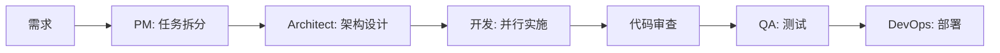

# HelloAgents 项目团队配置

> 从专业开发团队人才库 (`../.claude/agents/`) 中选调的项目成员

## 项目信息

- **项目名称**: HelloAgents Learning Platform
- **项目类型**: Agent 学习平台（教育科技）
- **技术栈**: React 19 + TypeScript + FastAPI + PostgreSQL
- **当前阶段**: MVP → 成长期
- **团队规模**: 5人核心团队 + 3人顾问

## 核心团队（全职投入）

### 1. Technical Architect
**角色配置**: `architect`
**投入度**: 60%
**核心职责**:
- 整体架构设计与技术决策
- 代码执行安全架构设计
- 关键代码审查
- 技术难题攻关

**关键任务**:
- 设计代码隔离执行方案
- AI 集成架构设计
- 性能优化架构指导

---

### 2. Senior Frontend Developer
**角色配置**: `frontend-lead`
**投入度**: 100% (全职)
**核心职责**:
- 前端架构和核心组件开发
- Monaco Editor 集成与定制
- 主题系统实现
- 前端性能优化

**关键任务**:
- 学习页面开发（LearnPage）
- 代码编辑器功能完善
- AI 助手聊天界面
- 响应式布局和主题切换

**兼任**: Frontend Performance Engineer 职责

---

### 3. Senior Backend Developer
**角色配置**: `backend-lead`
**投入度**: 100% (全职)
**核心职责**:
- 后端 API 设计与开发
- 代码执行服务实现
- AI 服务集成（DeepSeek API）
- 数据库设计与优化

**关键任务**:
- RESTful API 开发
- 代码执行沙箱实现
- AI 对话接口开发
- 课程内容管理 API

**兼任**: API Architect, DB Architect 职责

---

### 4. DevOps Engineer
**角色配置**: `devops`
**投入度**: 40%
**核心职责**:
- CI/CD 流水线搭建
- Docker 容器化部署
- 环境配置管理
- 基础监控配置

**关键任务**:
- GitHub Actions 配置
- Docker Compose 编排
- 前后端分离部署
- 日志和监控初步配置

**兼任**: 部分 SRE 职责

---

### 5. Technical Project Manager
**角色配置**: `pm`
**投入度**: 80%
**核心职责**:
- 项目进度管理
- 团队任务协调
- 需求优先级管理
- 风险识别与控制

**关键任务**:
- Sprint 规划与跟踪
- 每日站会组织
- 进度报告
- 障碍移除

## 顾问团队（按需参与）

### 6. UI/UX Engineer
**角色配置**: `ui-engineer`
**投入度**: 30%
**参与场景**:
- 学习平台界面设计
- 交互体验优化
- 设计系统建立

**输出**:
- Figma 设计稿
- 组件设计规范
- 用户流程图

---

### 7. QA Automation Engineer
**角色配置**: `qa-automation`
**投入度**: 40%
**参与场景**:
- E2E 测试编写
- 单元测试补充
- 代码执行安全测试

**输出**:
- Playwright 测试套件
- 测试覆盖率报告
- Bug 报告

---

### 8. Security Auditor
**角色配置**: `security`
**投入度**: 20%
**参与场景**:
- 代码执行安全审计
- 用户输入安全检查
- 每月安全扫描

**输出**:
- 安全审计报告
- 漏洞修复建议
- 安全配置优化

## 协作流程

### 日常开发流程



### 沟通机制

**日常沟通**:
- Slack #helloagents-dev
- GitHub Issues/PR

**定期会议**:
- Daily Standup: 每天 15 分钟（核心团队）
- Weekly Tech Sync: 每周 1 小时（Architect + Tech Leads）
- Sprint Planning: 每两周 2 小时（全体）

### 代码审查规则

**审查分配**:
- 前端代码: Frontend Lead 或 Architect
- 后端代码: Backend Lead 或 Architect
- 关键架构变更: 必须 Architect 审查

**审查标准**:
- 功能正确性 ✓
- 代码质量 ✓
- 性能影响 ✓
- 安全性 ✓
- 测试覆盖 ✓

## 决策机制

### 技术决策层级

```yaml
Level 1 - 架构方向:
  决策者: Technical Architect
  咨询: Frontend Lead, Backend Lead
  示例: 代码执行技术选型、AI 集成方案

Level 2 - 模块设计:
  决策者: 对应 Tech Lead
  审批: Architect (重大变更)
  示例: API 设计、组件架构

Level 3 - 实现细节:
  决策者: 开发者
  审查: Tech Lead
  示例: 函数实现、样式调整
```

## 任务分工示例

### 功能: 添加"代码片段收藏"

| 角色 | 任务 | 产出 |
|------|------|------|
| Architect | 设计存储方案和架构 | 架构设计文档 |
| Backend Lead | 实现收藏 API | API 接口 + 单元测试 |
| Frontend Lead | 实现收藏 UI 组件 | React 组件 + 集成 |
| QA Automation | 编写 E2E 测试 | Playwright 测试 |
| DevOps | 数据库迁移和部署 | 迁移脚本 + 部署 |
| PM | 跟踪进度 | 任务看板更新 |

## 扩展计划

### Q2 2024 (成长期)
- QA Automation → 60% 投入（增加测试覆盖）
- Security Auditor → 30% 投入（加强安全）
- Tech Writer → 30% 投入（完善文档）

### Q3-Q4 2024 (成熟期)
- 考虑增加: Performance Engineer (性能优化)
- 考虑增加: 第二位前端/后端开发者
- 考虑增加: 专职 SRE (运维保障)

## 成功指标

**开发效率**:
- Sprint 目标达成率 > 85%
- 代码审查响应时间 < 24h
- 部署频率 > 2次/周

**代码质量**:
- 测试覆盖率 > 80%
- 代码审查通过率 > 90%
- 生产环境 Bug < 5个/月

**团队协作**:
- 团队满意度 > 4/5
- 会议效率评分 > 4/5
- 知识共享频率 > 1次/周

---

*配置日期: 2024-01-08*
*下次评审: 2024-03 (每季度评审调整)*
