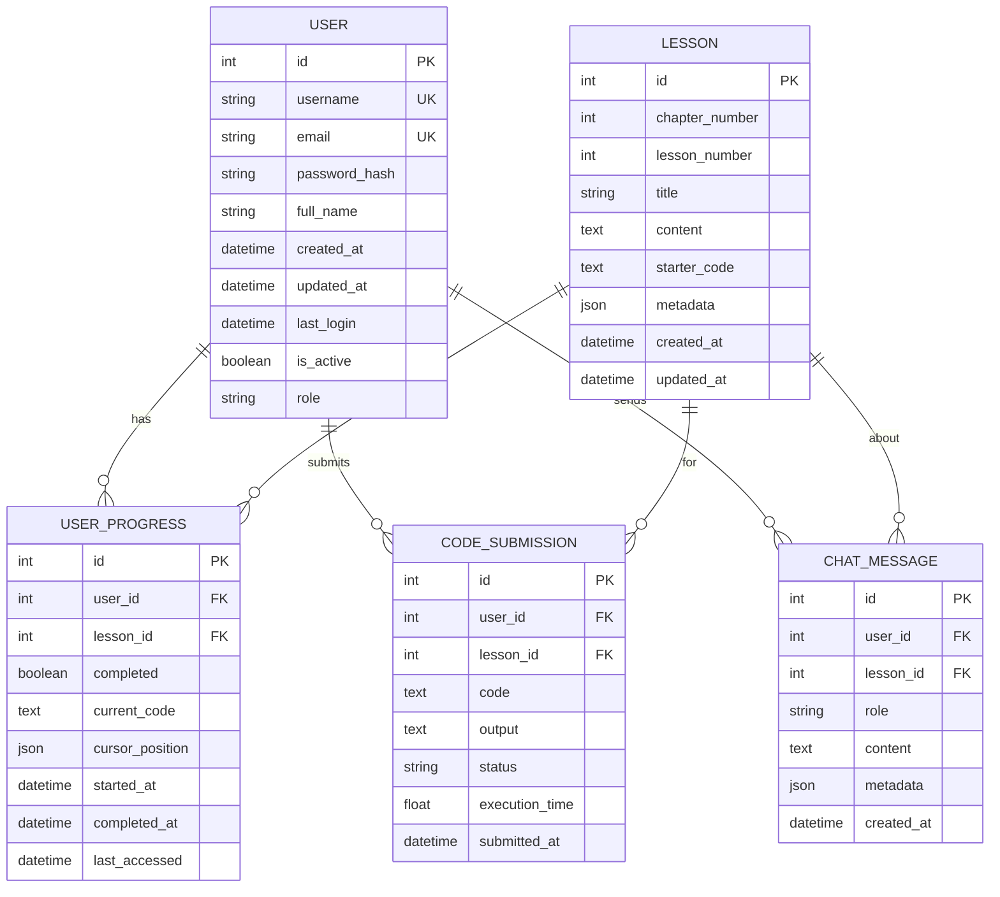

# HelloAgents 数据库设计文档

**设计日期**: 2026-01-08
**数据库**: SQLite 3.35+
**ORM**: SQLAlchemy 2.0+
**场景**: 本地学习和数据存储（单用户）

---

## 1. 概述

HelloAgents 学习平台是**本地单用户学习工具**，需要支持以下核心功能：
- 本地用户配置（用户名、设置）
- 课程内容管理
- 学习进度跟踪
- 代码提交历史
- AI 对话记录

**SQLite 优势**：
- ✅ 零配置，无需安装数据库服务器
- ✅ 文件级数据库（`backend/helloagents.db`）
- ✅ 轻量级，适合单用户场景
- ✅ 完整的 SQL 支持
- ✅ 支持事务和外键约束

## 2. 数据库架构

### ER 图



## 3. 表结构详细设计

### 3.1 users - 用户配置表（简化为单用户）

```sql
CREATE TABLE users (
    id INTEGER PRIMARY KEY AUTOINCREMENT,
    username TEXT NOT NULL UNIQUE,
    full_name TEXT,
    settings TEXT DEFAULT '{}',  -- JSON 格式的用户设置
    created_at TEXT DEFAULT CURRENT_TIMESTAMP,
    updated_at TEXT DEFAULT CURRENT_TIMESTAMP,
    last_login TEXT
);

CREATE INDEX idx_users_username ON users(username);
```

**字段说明**:
- `id`: 主键，自增
- `username`: 用户名（本地用户标识）
- `full_name`: 用户全名
- `settings`: JSON 格式的用户设置（主题、编辑器配置等）
- 注意：**移除了** `password_hash`, `email`, `role` 等字段（本地单用户无需认证）

**settings JSON 示例**:
```json
{
  "theme": "dark",
  "editor": {
    "fontSize": 14,
    "tabSize": 4,
    "wordWrap": true
  },
  "ai": {
    "preferredModel": "deepseek-chat"
  }
}
```

### 3.2 lessons - 课程表

```sql
CREATE TABLE lessons (
    id INTEGER PRIMARY KEY AUTOINCREMENT,
    chapter_number INTEGER NOT NULL,
    lesson_number INTEGER NOT NULL,
    title TEXT NOT NULL,
    content TEXT NOT NULL,
    starter_code TEXT,
    metadata TEXT DEFAULT '{}',  -- JSON 格式
    created_at TEXT DEFAULT CURRENT_TIMESTAMP,
    updated_at TEXT DEFAULT CURRENT_TIMESTAMP,
    UNIQUE (chapter_number, lesson_number)
);

CREATE INDEX idx_lessons_chapter ON lessons(chapter_number);
```

**字段说明**:
- `chapter_number`: 章节号（1-16）
- `lesson_number`: 课时号（章节内的序号）
- `title`: 课程标题
- `content`: Markdown 格式的课程内容
- `starter_code`: 初始代码模板
- `metadata`: JSON 格式的元数据（标签、难度、预计时长等）

**metadata 结构示例**:
```json
{
  "difficulty": "beginner",
  "estimated_time": 30,
  "tags": ["react", "prompt-engineering"],
  "prerequisites": [1, 2],
  "learning_objectives": ["理解 ReAct 模式", "实现简单 Agent"]
}
```

### 3.3 user_progress - 学习进度表

```sql
CREATE TABLE user_progress (
    id INTEGER PRIMARY KEY AUTOINCREMENT,
    user_id INTEGER NOT NULL,
    lesson_id INTEGER NOT NULL,
    completed INTEGER DEFAULT 0,  -- SQLite: 0=false, 1=true
    current_code TEXT,
    cursor_position TEXT DEFAULT '{"line": 1, "column": 1}',  -- JSON
    started_at TEXT DEFAULT CURRENT_TIMESTAMP,
    completed_at TEXT,
    last_accessed TEXT DEFAULT CURRENT_TIMESTAMP,
    UNIQUE (user_id, lesson_id),
    FOREIGN KEY (user_id) REFERENCES users(id) ON DELETE CASCADE,
    FOREIGN KEY (lesson_id) REFERENCES lessons(id) ON DELETE CASCADE
);

CREATE INDEX idx_progress_user ON user_progress(user_id);
CREATE INDEX idx_progress_lesson ON user_progress(lesson_id);
CREATE INDEX idx_progress_completed ON user_progress(completed);
CREATE INDEX idx_progress_last_accessed ON user_progress(last_accessed);
```

**字段说明**:
- `user_id`: 用户 ID（外键）
- `lesson_id`: 课程 ID（外键）
- `completed`: 是否完成
- `current_code`: 用户当前的代码（自动保存）
- `cursor_position`: 光标位置（Monaco Editor）
- `last_accessed`: 最后访问时间（用于排序"最近学习"）

### 3.4 code_submissions - 代码提交表

```sql
CREATE TABLE code_submissions (
    id INTEGER PRIMARY KEY AUTOINCREMENT,
    user_id INTEGER NOT NULL,
    lesson_id INTEGER NOT NULL,
    code TEXT NOT NULL,
    output TEXT,
    status TEXT NOT NULL CHECK (status IN ('success', 'error', 'timeout')),
    execution_time REAL,
    submitted_at TEXT DEFAULT CURRENT_TIMESTAMP,
    FOREIGN KEY (user_id) REFERENCES users(id) ON DELETE CASCADE,
    FOREIGN KEY (lesson_id) REFERENCES lessons(id) ON DELETE CASCADE
);

CREATE INDEX idx_submissions_user ON code_submissions(user_id);
CREATE INDEX idx_submissions_lesson ON code_submissions(lesson_id);
CREATE INDEX idx_submissions_submitted_at ON code_submissions(submitted_at);
CREATE INDEX idx_submissions_status ON code_submissions(status);
```

**字段说明**:
- `code`: 提交的代码
- `output`: 执行输出（stdout + stderr）
- `status`: 执行状态（success/error/timeout）
- `execution_time`: 执行时间（秒）
- `submitted_at`: 提交时间

### 3.5 chat_messages - 聊天消息表

```sql
CREATE TABLE chat_messages (
    id INTEGER PRIMARY KEY AUTOINCREMENT,
    user_id INTEGER NOT NULL,
    lesson_id INTEGER,
    role TEXT NOT NULL CHECK (role IN ('user', 'assistant', 'system')),
    content TEXT NOT NULL,
    metadata TEXT DEFAULT '{}',  -- JSON
    created_at TEXT DEFAULT CURRENT_TIMESTAMP,
    FOREIGN KEY (user_id) REFERENCES users(id) ON DELETE CASCADE,
    FOREIGN KEY (lesson_id) REFERENCES lessons(id) ON DELETE SET NULL
);

CREATE INDEX idx_chat_user ON chat_messages(user_id);
CREATE INDEX idx_chat_lesson ON chat_messages(lesson_id);
CREATE INDEX idx_chat_created_at ON chat_messages(created_at);
```

**字段说明**:
- `role`: 消息角色（user/assistant/system）
- `content`: 消息内容
- `metadata`: 额外信息（token 数量、模型、上下文等）

**metadata 结构示例**:
```json
{
  "model": "deepseek-chat",
  "tokens": 150,
  "context_type": "code_help",
  "sentiment": "confused"
}
```

## 4. 数据迁移策略

### 4.1 从 localStorage 迁移数据

**当前 localStorage 数据结构**:
```typescript
// 学习进度
localStorage.setItem('helloagents_progress', JSON.stringify({
  currentLesson: { chapter: 1, lesson: 1 },
  completedLessons: [{ chapter: 1, lesson: 1 }],
  lastCode: { '1-1': 'print("hello")' }
}));

// 聊天历史
localStorage.setItem('helloagents_chat_1-1', JSON.stringify([
  { role: 'user', content: '...' },
  { role: 'assistant', content: '...' }
]));
```

**迁移脚本** (`backend/scripts/migrate_localstorage.py`):
```python
# 提供一个 API 端点让前端上传 localStorage 数据
# POST /api/migrate/progress
# 后端解析并保存到数据库
```

### 4.2 Alembic 版本管理

```bash
# 初始化 Alembic
alembic init alembic

# 创建迁移
alembic revision --autogenerate -m "Initial schema"

# 执行迁移
alembic upgrade head

# 回滚
alembic downgrade -1
```

## 5. 性能优化

### 5.1 索引策略

**已创建的索引**:
- 用户表: username, email（唯一索引）
- 进度表: user_id, lesson_id, completed, last_accessed
- 提交表: user_id, lesson_id, submitted_at, status
- 聊天表: user_id, lesson_id, created_at

### 5.2 查询优化

**常见查询优化**:

```sql
-- 1. 获取用户学习进度（带课程信息）
-- 使用 JOIN 避免 N+1 查询
SELECT
    l.chapter_number,
    l.lesson_number,
    l.title,
    up.completed,
    up.last_accessed
FROM user_progress up
JOIN lessons l ON up.lesson_id = l.id
WHERE up.user_id = $1
ORDER BY up.last_accessed DESC;

-- 2. 获取用户最近的代码提交（分页）
-- 使用索引 idx_submissions_user 和 idx_submissions_submitted_at
SELECT *
FROM code_submissions
WHERE user_id = $1
ORDER BY submitted_at DESC
LIMIT 20 OFFSET 0;

-- 3. 统计课程完成率
-- 使用索引 idx_progress_lesson 和 idx_progress_completed
SELECT
    lesson_id,
    COUNT(*) as total_users,
    SUM(CASE WHEN completed THEN 1 ELSE 0 END) as completed_users
FROM user_progress
GROUP BY lesson_id;
```

### 5.3 分区策略（未来考虑）

当数据量增长后，考虑对大表进行分区：

```sql
-- 按月分区 code_submissions 表
CREATE TABLE code_submissions_2026_01 PARTITION OF code_submissions
FOR VALUES FROM ('2026-01-01') TO ('2026-02-01');
```

## 6. 数据安全

### 6.1 敏感数据保护

- **密码**: 使用 bcrypt 哈希（成本因子 12）
- **API 密钥**: 不存储在数据库，使用环境变量
- **备份加密**: PostgreSQL pg_dump 输出使用 GPG 加密

### 6.2 访问控制

```sql
-- 创建只读用户（用于分析）
CREATE USER analytics_readonly WITH PASSWORD 'secure_password';
GRANT CONNECT ON DATABASE helloagents TO analytics_readonly;
GRANT SELECT ON ALL TABLES IN SCHEMA public TO analytics_readonly;

-- 创建应用用户（读写）
CREATE USER helloagents_app WITH PASSWORD 'secure_password';
GRANT ALL PRIVILEGES ON ALL TABLES IN SCHEMA public TO helloagents_app;
GRANT USAGE, SELECT ON ALL SEQUENCES IN SCHEMA public TO helloagents_app;
```

### 6.3 数据保留策略

```sql
-- 自动清理 90 天前的聊天记录（保护隐私）
DELETE FROM chat_messages
WHERE created_at < NOW() - INTERVAL '90 days';

-- 归档 1 年前的代码提交（移至冷存储）
-- 使用定时任务执行
```

## 7. 本地性能优化

### 7.1 SQLite 优化配置

```python
# database.py - SQLite 连接配置
import sqlite3

def get_db_connection():
    conn = sqlite3.connect('helloagents.db')

    # 启用外键约束
    conn.execute('PRAGMA foreign_keys = ON')

    # 优化性能
    conn.execute('PRAGMA journal_mode = WAL')  # Write-Ahead Logging
    conn.execute('PRAGMA synchronous = NORMAL')
    conn.execute('PRAGMA cache_size = -64000')  # 64MB 缓存
    conn.execute('PRAGMA temp_store = MEMORY')

    return conn
```

### 7.2 查询优化

**常用查询应使用索引**:
```sql
-- 获取用户最近学习的课程（使用 idx_progress_last_accessed）
SELECT l.*, up.last_accessed
FROM user_progress up
JOIN lessons l ON up.lesson_id = l.id
WHERE up.user_id = ?
ORDER BY up.last_accessed DESC
LIMIT 10;

-- 获取课程的代码提交历史（使用 idx_submissions_lesson）
SELECT *
FROM code_submissions
WHERE lesson_id = ?
ORDER BY submitted_at DESC
LIMIT 20;
```

## 8. 本地备份策略

### 8.1 简单备份

```bash
# 手动备份（复制数据库文件）
cp backend/helloagents.db backend/backups/helloagents_$(date +%Y%m%d).db

# 导出为 SQL（可读格式）
sqlite3 backend/helloagents.db .dump > backup.sql

# 从 SQL 恢复
sqlite3 backend/helloagents_new.db < backup.sql
```

### 8.2 自动备份脚本

```python
# backend/scripts/backup.py
import shutil
from datetime import datetime
from pathlib import Path

def backup_database():
    db_path = Path('backend/helloagents.db')
    backup_dir = Path('backend/backups')
    backup_dir.mkdir(exist_ok=True)

    timestamp = datetime.now().strftime('%Y%m%d_%H%M%S')
    backup_path = backup_dir / f'helloagents_{timestamp}.db'

    shutil.copy2(db_path, backup_path)
    print(f'Backup created: {backup_path}')

    # 只保留最近 7 天的备份
    for old_backup in sorted(backup_dir.glob('*.db'))[:-7]:
        old_backup.unlink()
```

## 9. 下一步行动

1. ✅ 数据库设计完成（SQLite 本地版本）
2. ⏳ 创建 SQLAlchemy 模型（`backend/app/models/`）
3. ⏳ 实现数据库连接（`backend/app/database.py`）
4. ⏳ 编写初始化脚本（创建表）
5. ⏳ 实现 localStorage → SQLite 数据迁移工具

**注意**: 由于是本地单用户场景，**移除了以下企业级特性**：
- ❌ 用户认证系统（JWT）- 本地无需登录
- ❌ Redis 缓存 - SQLite 已足够快
- ❌ 数据库主从复制 - 本地单实例
- ❌ 访问控制和权限系统 - 单用户无需
- ❌ API 限流 - 本地使用无需限流

---

**设计者**: Technical Architect + Backend Lead
**更新日期**: 2026-01-08
